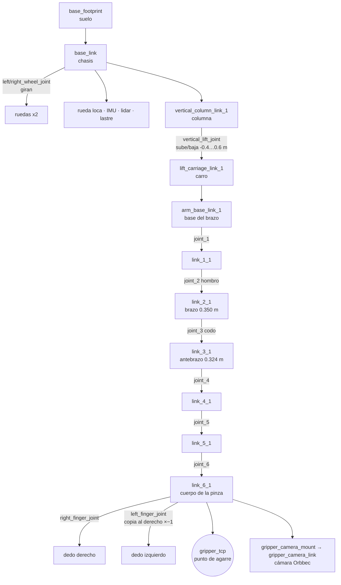
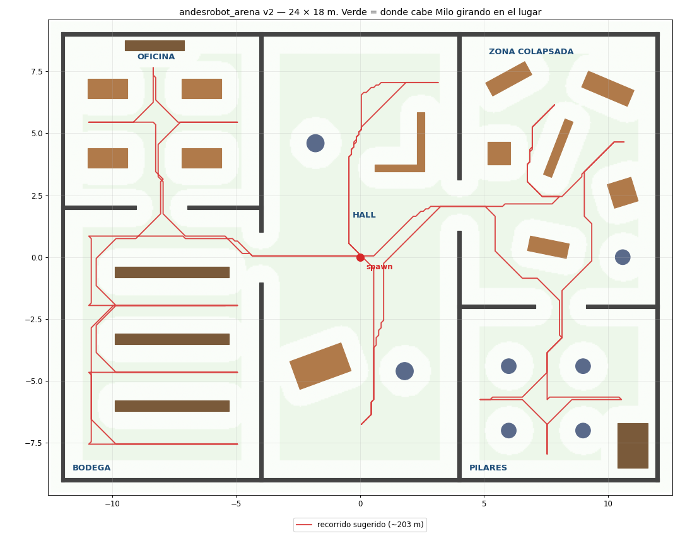
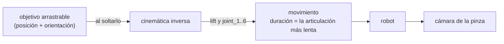

# Milo en el navegador: guía visual para armar una escena interactiva (Vite + three.js)

Guía para construir una escena web de Milo: qué piezas tiene el robot, dónde va cada una, de qué
color, cómo se mueve, qué hay en la arena, y cómo reproducir la cinemática inversa y la cámara de la
pinza para que se comporte como en Gazebo. Trae los datos listos (sección 1); la aplicación se
arma a partir de esto.

---

## 1. Los datos: el paquete para la web

```
ros2_ws/escena_web/          <- lo genera el exportador (fuera de git, se regenera)
├── milo.urdf                el robot: URDF normal, sin xacro ni plugins de Gazebo
├── meshes/*.stl             17 mallas (en milímetros)
├── robot.json               el robot ya interpretado, para leerlo desde JavaScript (sección 4)
└── escena.json              la arena y la mesa de prueba (sección 5)
```

Se genera dentro de Docker, porque necesita el workspace compilado. Hay que volver a correrlo cada
vez que cambie el xacro o un mundo:

```bash
./sim.sh shell
python3 /ros2_ws/src/andesrobot_arm/scripts/exportar_escena_web.py
# -> ~/milo_ws/ros2_ws/escena_web/
```

Para usarlo en un proyecto de Vite, se copia esa carpeta a `public/` (por ejemplo `public/milo/`):
Vite sirve esos archivos tal cual (`/milo/milo.urdf`, `/milo/robot.json`, …).

**Librerías que encajan con estos datos:** `three` para la escena, `urdf-loader` (de gkjohnson) para
cargar `milo.urdf` con sus mallas y mover las articulaciones (`setJointValue`; entiende el `mimic`
del dedo izquierdo), y los controles de los ejemplos de three.js (`OrbitControls` para la cámara del
usuario, `TransformControls` para arrastrar un objetivo). Las mallas son STL: `STLLoader`.

---

## 2. Convenciones: lo que más errores causa

| | ROS (URDF, JSON) | three.js | Qué hacer |
|---|---|---|---|
| Arriba | **+Z** | **+Y** | Meter todo lo de ROS en un `Group` girado −90° en X. Adentro se usan las coordenadas de ROS tal cual. |
| Adelante / izquierda | +X adelante, +Y izquierda (REP-103) | — | Se conserva dentro del grupo |
| Unidades | metros, radianes | lo que uses | Usar metros: cámaras y luces quedan bien proporcionadas |
| Orientación `rpy` | R = Rz(yaw)·Ry(pitch)·Rx(roll) | `Euler` | Orden `'ZYX'` con los valores (roll, pitch, yaw) |
| Cuaterniones | (x, y, z, w) | `Quaternion(x, y, z, w)` | Mismo orden |
| Cilindros | eje a lo largo de **Z** | `CylinderGeometry` a lo largo de **Y** | Girar la geometría 90° en X |
| Mallas STL | en **milímetros** | — | El URDF ya trae `scale="0.001 …"`; `urdf-loader` la aplica |
| Colores | rgba de 0 a 1 | `Color` | Interpretarlos como sRGB |
| Matrices 4x4 | por filas | `Matrix4.set()` también recibe filas | Pasarlas en el mismo orden |
| Frames ópticos de cámara | Z adelante, Y abajo | la cámara mira a −Z, Y arriba | Colgar la cámara del frame óptico y girarla 180° en X |

**Color de las mallas:** los STL salieron de Fusion con un color en el encabezado (`COLOR=`), y el
`STLLoader` de three.js lo detecta. Para que no aparezcan colores raros, conviene darle a cada malla
un material propio con el color de `robot.json` (sección 3).

---

## 3. El robot de un vistazo


Medidas (con el brazo vertical y el lift en 0): 0.556 m de largo, 0.500 m de ancho, 1.816 m de
alto. Base del brazo a 0.920 m; el lift la sube o baja entre 0.520 y 1.520 m. Más medidas y la
cadena acotada en `ros2_ws/src/andesrobot_arm/docs/figuras/` y en el informe (`docs/informe/`).

### Árbol de piezas

Cada caja es un *link* (una pieza rígida); cada flecha, un *joint* (la unión). Las flechas con
nombre son las articulaciones que se mueven.



### Piezas visibles

| Link | Malla / forma | Color sugerido | Qué es |
|---|---|---|---|
| `base_link` | `base_link.stl` | gris `#a9a8a0` | chasis de perfiles |
| `left/right_wheel_link_1` | `*_wheel_link_1.stl` | gris | ruedas de hoverboard (Ø 165 mm) |
| `front_caster_link_1` | caja | gris | rueda loca |
| `lidar_link_1`, `imu_link_1` | caja (STL de 12 triángulos) | gris | RPLIDAR C1 e IMU |
| `ballast_link` | caja 0.25 × 0.30 × 0.04 m | gris | lastre de 12 kg (baterías) |
| `vertical_column_link_1` | caja (STL) | gris oscuro `#7d7c74` | columna de 6 × 6 cm |
| `lift_carriage_link_1` | caja (STL) | gris oscuro | carro del lift |
| `arm_base_link_1` … `link_5_1` | `link_N_1.stl` | azul `#2a78d6` | brazo EB300 |
| `link_6_1` | `link_6_1.stl` | azul | cuerpo de la pinza EBG-20 |
| `right/left_finger_link_1` | `*_finger_link_1.stl` | naranjo `#eb6834` | dedos |
| `gripper_camera_mount` | cilindro + caja | naranjo | bisagra del soporte de la cámara |
| `gripper_camera_link` | `orbbec_gemini_plus.stl` | naranjo | cámara Orbbec Gemini Plus |

El URDF solo trae gris (`silver`, 0.7) y negro (`caster_black`, 0.1); los colores sugeridos están en
`robot.json` (`links[].color_sugerido`) y son los mismos de las figuras del informe. Al colorear un
link, conviene cambiar solo sus propias mallas, sin entrar a los links hijos (cuelgan de él a
través de sus joints).

Links **sin** forma (son solo puntos de referencia o masas): `base_footprint`, `gripper_tcp`, `laser`,
los frames de la cámara (`gripper_camera_{color,depth,ir}_frame` y sus `_optical_frame`), los
motores `motor_joint_1…6` y `gripper_servo_link`.

### Articulaciones que se mueven

| Articulación | Tipo | Eje (en su frame) | Rango | Nota |
|---|---|---|---|---|
| `vertical_lift_joint` | prismática | +Z | −0.4 … 0.6 m | sube y baja todo el brazo |
| `joint_1` | rotativa | +Z | ±π (provisorio) | gira la base del brazo |
| `joint_2` | rotativa | −X | ±π | hombro |
| `joint_3` | rotativa | +X | ±π | codo |
| `joint_4` | rotativa | −X | ±π | muñeca 1 |
| `joint_5` | rotativa | +Z | ±π | muñeca 2 |
| `joint_6` | rotativa | −X | ±π | muñeca 3 (gira la pinza) |
| `right_finger_joint` | prismática | +Y | −0.007 (cerrada) … 0.016 m (abierta) | apertura entre dedos = 0.017 + 2·q |
| `left_finger_joint` | prismática | +Y | — | **copia** a la derecha con multiplicador −1 (`mimic`) |
| `left/right_wheel_joint` | continua | −Y | — | ruedas; en la simulación del brazo la base no se mueve |

La pose inicial es todo en 0: el brazo queda vertical y la pinza apunta hacia adelante (+X), con el
TCP en (0.3551, 0, 1.7764) m.

---

## 4. `robot.json`

| Campo | Contenido |
|---|---|
| `convenciones` | unidades y ejes (sección 2) |
| `links[]` | nombre, visuales (malla o forma, `origen` xyz/rpy, escala, color del URDF), masa, `color_sugerido` |
| `joints[]` | nombre, tipo, padre, hijo, `origen`, `eje`, `limite` {inferior, superior, velocidad}, `copia_a` (mimic) |
| `articulaciones_moviles` | las 8 que conviene mostrar con un deslizador |
| `pinza` | articulación, valor abierta y cerrada |
| `cinematica_inversa` | `cadena` (las 11 uniones de `base_footprint` a `gripper_tcp`, en orden, con origen, eje y límites) y `parametros` (λ, paso, reinicios, tolerancias, peso del lift, velocidades) |
| `camara.sensores[]` | color, profundidad e infrarrojo: frame óptico, FOV horizontal, resolución, rango |

`milo.urdf` y `robot.json` describen lo mismo: el URDF sirve para `urdf-loader`, y el JSON para
leer datos sin parsear XML.

---

## 5. El escenario (`escena.json`)



| Parte | Contenido |
|---|---|
| `suelo` | plano de 100 × 100 m, gris claro |
| `luz` | sol (luz direccional) con dirección (−0.5, 0.1, −0.9): la luz viene desde el lado opuesto |
| `arena` | 24 × 18 m centrada en (0, 0); 37 objetos: 12 muros (1.5 m de alto), 8 muebles (escritorios y estantes), 6 pilares, 6 escombros, 2 barreras y 3 objetos sueltos (auto volcado, tambor, contenedor) |
| `mesa_prueba` | mesa de 0.6 × 0.8 m a 0.72 m de alto, centrada en x = 1.0 m; encima, cubo rojo (5 cm), cilindro verde (Ø 6 × 10 cm) y caja azul (4 × 8 × 12 cm) |
| `spawn_robot` | Milo aparece en (0, 0) mirando a +X |

Cada objeto trae `nombre`, `categoria`, `estatico`, `pose` {xyz, rpy} (el **centro** de la pieza),
`geometria` (`box` con `tamano` o `cylinder` con `radio` y `largo`) y `color` rgba. Todas las piezas
del mundo son cajas o cilindros, así que no necesitan archivos de mallas.

---

## 6. Cómo funciona Milo (lo que la escena tiene que reproducir)



En Gazebo, `arm_marker_node` publica la pose de un marcador y `arm_ik_node` calcula las
articulaciones y se las manda al controlador. Una escena web hace lo mismo en el navegador.

### 6.1 Cinemática directa (dónde queda la pinza)

Se recorre `cinematica_inversa.cadena` en orden, multiplicando matrices 4x4:

- cada unión aporta su `origen` (xyz + rpy) como matriz;
- si es **rotativa**, además una rotación de ángulo q alrededor de su `eje` (fórmula de Rodrigues);
- si es **prismática** (el lift), una traslación q·`eje`;
- las **fijas** solo aportan su `origen`.

El resultado es la pose del TCP (`gripper_tcp`) en `base_footprint`. Es exactamente lo que hace
`andesrobot_arm/andesrobot_arm/kinematics.py` (`ArmKinematics.fk`), que sirve de referencia.

### 6.2 Cinemática inversa (qué ángulos llevan la pinza a un objetivo)

Método numérico iterativo: mínimos cuadrados amortiguados (DLS) ponderados, con reinicios. Las
fórmulas están en el informe (sección 10); en pasos:

1. Partir de la postura actual q (7 valores: lift + joint_1..6, en el orden de la cadena).
2. Calcular el error: posición (objetivo − TCP actual) y orientación (vector de rotación de
   R_objetivo · R_actualᵀ). Si el error es menor que 0.1 mm y 0.001 rad, terminar.
3. Calcular el Jacobiano 6 × 7: para una rotativa, columna = [eje × (p_TCP − p_eje); eje]; para el
   lift, [eje; 0]. Los ejes y posiciones salen de la misma cadena de 6.1.
4. Paso: Δq = W⁻¹ Jᵀ (J W⁻¹ Jᵀ + λ² I)⁻¹ e, con λ = 0.01 y W = pesos (10 para el lift, 1 para el
   resto: así prefiere mover el brazo). Si |Δq| > 0.5, escalarlo a 0.5.
5. q ← q + Δq, y aplicar límites: el lift se recorta a −0.4…0.6 m; las rotativas con rango de vuelta
   completa (±π) "dan la vuelta" en vez de recortarse.
6. Repetir hasta 200 veces. Si no converge, reintentar desde posturas al azar dentro de los límites
   (hasta 20 veces) y quedarse con la primera que converja.
7. Si ninguna converge: el objetivo está fuera de alcance y el brazo **no se mueve**.

Todos estos números vienen en `robot.json` → `cinematica_inversa.parametros`.

**Valores de referencia** para comprobar una implementación (son los de Python y Gazebo):

| Prueba | Resultado esperado |
|---|---|
| Todo en 0 | TCP en (0.3551, 0, 1.7764) m, pinza apuntando a +X |
| Objetivo (0.5048, −0.2163, 1.862) m, cuaternión (−0.1252, 0.5501, −0.7869, 0.2502) | converge; Gazebo dejó el lift en +0.19 m |
| Jacobiano | su parte lineal coincide con diferencias finitas de la cinemática directa |
| Objetivo fuera de alcance (más de 0.97 m al frente, o más alto que 2.46 m) | no converge y el brazo no se mueve |

Para un mismo objetivo hay varias posturas posibles; con reinicios al azar distintos se puede
llegar a otra distinta de la de Gazebo. Es válido mientras el TCP llegue a la pose.

### 6.3 Movimiento

Igual que `arm_ik_node`: la duración la marca la articulación más lenta (brazo 0.5 rad/s, lift
0.1 m/s, mínimo 1 s), y todas llegan a la vez. Interpolar con arranque y frenado suaves se ve como
el controlador de Gazebo. La pinza se abre o cierra moviendo solo `right_finger_joint`.

### 6.4 Cámara de la pinza

Una cámara colgada de `gripper_camera_color_optical_frame` (girada 180° en X por la convención
óptica, sección 2), con el campo de visión vertical calculado del horizontal:

  vfov = 2 · atan( tan(hfov / 2) · alto / ancho )  →  56.3° para el color (640×480, hfov 71°)

La profundidad mide de 0.25 a 2.5 m (hfov 67.9°, 640×400): por eso la cámara no da profundidad de la
punta de los dedos, que están a ~9 cm. Con el brazo en 0 la cámara mira al frente; para ver la mesa,
la pinza tiene que quedar sobre ella apuntando hacia abajo (por ejemplo, TCP en (0.5, 0, 1.4) m con
cuaternión (0.3827, 0, 0.9239, 0), la pose de `andesrobot_arm/docs/BRAZO.md`).

### 6.5 Lo que Gazebo simula y la web no

| Falta | Cómo agregarlo si hace falta |
|---|---|
| Física: los objetos no caen ni se empujan | motor de física en JS (Rapier o cannon-es) con las cajas y cilindros de `escena.json` |
| Choques del brazo con la mesa o el robot | la IK tampoco los revisa en Gazebo; se pueden aproximar con cajas simples |
| Imagen de profundidad | renderizar la cámara de la pinza a un render target con textura de profundidad |
| Ruido de la cámara real | ver «Cómo hacer realista la profundidad» en el informe, sección 14 |

---

## 7. Pasos sugeridos

1. Generar el paquete (sección 1) y copiarlo a `public/` del proyecto de Vite.
2. Escena vacía con el grupo girado de ROS a three.js (sección 2), luces y suelo.
3. Cargar `escena.json` y dibujar la arena y la mesa (cajas y cilindros).
4. Cargar `milo.urdf` y pintarlo con los colores sugeridos.
5. Deslizadores para las 8 articulaciones móviles, con los límites de `robot.json`.
6. Cinemática directa y comprobar la pose cero (sección 6.2).
7. Cinemática inversa y un objetivo arrastrable; comprobar con los valores de referencia.
8. Cámara de la pinza en un recuadro.

## 8. Mantenerlo al día

- Si cambia la geometría (xacro, mallas, cámara) o un mundo, volver a correr el exportador.
- Si cambia `kinematics.py`, revisar que la implementación web siga dando los mismos valores de
  referencia.
- `ros2_ws/escena_web/` está en `.gitignore`: se regenera.
