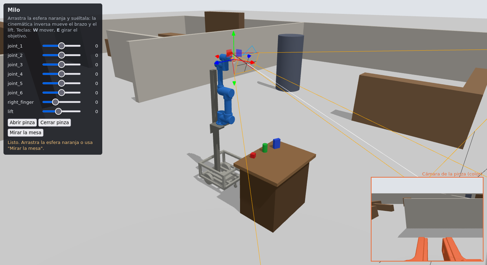
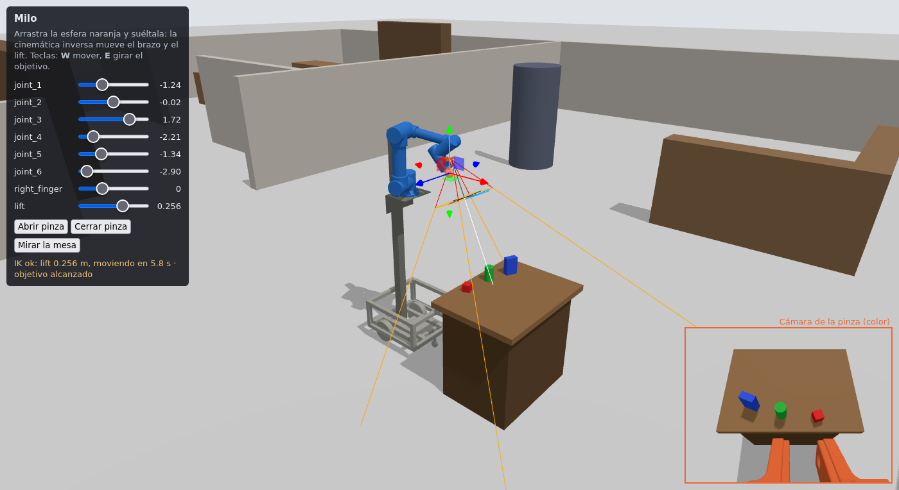
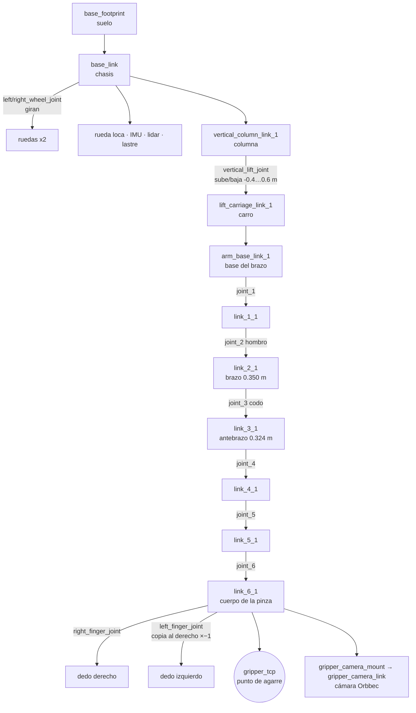
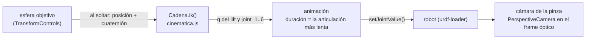

# Milo en el navegador: guía visual para una escena interactiva (Vite + three.js)

Todo lo necesario para dibujar a Milo y su escenario en una página web y que se comporte como en
Gazebo: qué piezas tiene el robot, dónde va cada una, de qué color, cómo se mueve, qué hay en la
arena y cómo reproducir la cinemática inversa y la cámara de la pinza.

| Escena inicial | Después de «Mirar la mesa» (IK + cámara) |
|---|---|
|  |  |

Capturas del ejemplo de esta carpeta (`ejemplo_vite/`), probado en Firefox: el brazo azul, la pinza
y la cámara en naranjo, la mesa de prueba, el volumen que ve la cámara (líneas naranjas) y, abajo a
la derecha, la imagen de la cámara de la pinza. La segunda captura muestra lo mismo que capturó la
cámara simulada en Gazebo (informe, figura 7).

---

## 1. Qué hay y cómo se genera

```
ros2_ws/escena_web/          <- lo genera el exportador (fuera de git, se regenera)
├── milo.urdf                el robot: URDF normal, sin xacro ni plugins de Gazebo
├── meshes/*.stl             17 mallas (en milímetros)
├── robot.json               el robot "masticado" para JavaScript (ver sección 4)
└── escena.json              la arena y la mesa de prueba (ver sección 5)

docs/escena_web/
├── README.md                esta guía
├── img/                     capturas
└── ejemplo_vite/            ejemplo mínimo que funciona (three.js + urdf-loader + IK)
    ├── src/cinematica.js    cinemática directa e inversa en JavaScript (traducción de kinematics.py)
    ├── src/main.js          la escena
    └── test_cinematica.mjs  prueba de cinematica.js contra los valores de Python
```

**Generar el paquete** (dentro de Docker, porque necesita el workspace compilado). Hay que
volver a correrlo cada vez que cambie el xacro o un mundo:

```bash
./sim.sh shell
python3 /ros2_ws/src/andesrobot_arm/scripts/exportar_escena_web.py
# -> ~/milo_ws/ros2_ws/escena_web/
```

**Correr el ejemplo** (necesita Node.js 18 o más). Si el PC no tiene Node, se usa con Docker,
igual que en la segunda línea:

```bash
cd ~/milo_ws/docs/escena_web/ejemplo_vite
npm install && npm run dev            # abre http://localhost:5173
# sin Node instalado:
docker run --rm -it --user $(id -u):$(id -g) -e HOME=/tmp --network host \
  -v ~/milo_ws:/milo_ws -w /milo_ws/docs/escena_web/ejemplo_vite node:20-slim \
  sh -c "npm install && npx vite --port 5173"
npm test                              # prueba de cinematica.js (20/20 poses, misma pose cero que Python)
```

`vite.config.js` sirve directamente `ros2_ws/escena_web/` como carpeta pública, así que no hay que
copiar nada. En un proyecto propio, copia esa carpeta a `public/milo/` y cambia las rutas
`/milo.urdf`, `/robot.json` y `/escena.json` de `main.js` por `/milo/…`.

Versiones probadas: `three` 0.169.0, `urdf-loader` 0.12.3, `vite` 5.4.8.

---

## 2. Convenciones: lo que más errores causa

| | ROS (URDF, JSON) | three.js | Qué hacer |
|---|---|---|---|
| Arriba | **+Z** | **+Y** | Meter todo lo de ROS en un `Group` con `rotation.x = -Math.PI / 2`. Adentro se usan las coordenadas de ROS tal cual. |
| Adelante / izquierda | +X adelante, +Y izquierda (REP-103) | — | Se conserva dentro del grupo |
| Unidades | metros, radianes | lo que uses | Usar metros: las cámaras y la luz quedan bien proporcionadas |
| Orientación `rpy` | R = Rz(yaw)·Ry(pitch)·Rx(roll) | `Euler` | `obj.rotation.set(roll, pitch, yaw, 'ZYX')` |
| Cuaterniones | (x, y, z, w) | `Quaternion(x, y, z, w)` | Mismo orden |
| Cilindros | eje a lo largo de **Z** | `CylinderGeometry` a lo largo de **Y** | `geometry.rotateX(Math.PI / 2)` |
| Mallas STL | en **milímetros** | — | El URDF ya trae `scale="0.001 …"`; `urdf-loader` la aplica |
| Colores | rgba de 0 a 1 | `Color` | `new Color().setRGB(r, g, b, SRGBColorSpace)` |
| Matrices de `cinematica.js` | 16 números por filas | `Matrix4.set(...)` también recibe filas | `new Matrix4().set(...T)` |
| Frames ópticos de cámara | Z adelante, Y abajo | la cámara mira a −Z, Y arriba | Agregar la `PerspectiveCamera` al frame óptico con `rotation.x = Math.PI` |

**Color de las mallas:** los STL salieron de Fusion con un color en el encabezado (`COLOR=`), y el
`STLLoader` de three.js lo detecta. Para que no aparezcan colores raros, usar un material propio en
cada malla (el ejemplo lo hace en `pintarRobot()`).

---

## 3. El robot de un vistazo


Medidas (con el brazo vertical y el lift en 0): 0.556 m de largo, 0.500 m de ancho, 1.816 m de
alto. Base del brazo a 0.920 m; el lift la sube o baja entre 0.520 y 1.520 m. Más medidas y la
cadena acotada en `ros2_ws/src/andesrobot_arm/docs/figuras/` y en el informe (`docs/informe/`).

### Árbol de piezas

Cada caja es un *link* (una pieza rígida); cada flecha, un *joint* (la unión). Las flechas con
nombre son las articulaciones que se mueven.



### Piezas visibles

| Link | Malla / forma | Color sugerido | Qué es |
|---|---|---|---|
| `base_link` | `base_link.stl` | gris `#a9a8a0` | chasis de perfiles |
| `left/right_wheel_link_1` | `*_wheel_link_1.stl` | gris | ruedas de hoverboard (Ø 165 mm) |
| `front_caster_link_1` | caja | gris | rueda loca |
| `lidar_link_1`, `imu_link_1` | caja (STL de 12 triángulos) | gris | RPLIDAR C1 e IMU |
| `ballast_link` | caja 0.25 × 0.30 × 0.04 m | gris | lastre de 12 kg (baterías) |
| `vertical_column_link_1` | caja (STL) | gris oscuro `#7d7c74` | columna de 6 × 6 cm |
| `lift_carriage_link_1` | caja (STL) | gris oscuro | carro del lift |
| `arm_base_link_1` … `link_5_1` | `link_N_1.stl` | azul `#2a78d6` | brazo EB300 |
| `link_6_1` | `link_6_1.stl` | azul | cuerpo de la pinza EBG-20 |
| `right/left_finger_link_1` | `*_finger_link_1.stl` | naranjo `#eb6834` | dedos |
| `gripper_camera_mount` | cilindro + caja | naranjo | bisagra del soporte de la cámara |
| `gripper_camera_link` | `orbbec_gemini_plus.stl` | naranjo | cámara Orbbec Gemini Plus |

El URDF solo trae gris (`silver`, 0.7) y negro (`caster_black`, 0.1); los colores sugeridos están en
`robot.json` (`links[].color_sugerido`) y son los mismos de las figuras del informe.

Links **sin** forma (son solo puntos de referencia o masas): `base_footprint`, `gripper_tcp`, `laser`,
los frames de la cámara (`gripper_camera_{color,depth,ir}_frame` y sus `_optical_frame`), los
motores `motor_joint_1…6` y `gripper_servo_link`.

### Articulaciones que se mueven

| Articulación | Tipo | Eje (en su frame) | Rango | Nota |
|---|---|---|---|---|
| `vertical_lift_joint` | prismática | +Z | −0.4 … 0.6 m | sube y baja todo el brazo |
| `joint_1` | rotativa | +Z | ±π (provisorio) | gira la base del brazo |
| `joint_2` | rotativa | −X | ±π | hombro |
| `joint_3` | rotativa | +X | ±π | codo |
| `joint_4` | rotativa | −X | ±π | muñeca 1 |
| `joint_5` | rotativa | +Z | ±π | muñeca 2 |
| `joint_6` | rotativa | −X | ±π | muñeca 3 (gira la pinza) |
| `right_finger_joint` | prismática | +Y | −0.007 (cerrada) … 0.016 m (abierta) | apertura entre dedos = 0.017 + 2·q |
| `left_finger_joint` | prismática | +Y | — | **copia** a la derecha con multiplicador −1 (`mimic`) |
| `left/right_wheel_joint` | continua | −Y | — | ruedas; en la simulación del brazo la base no se mueve |

Con `urdf-loader`: `robot.setJointValue('joint_2', 0.5)`. El dedo izquierdo se mueve solo, porque la
librería entiende el `mimic`. La pose inicial es todo en 0: el brazo queda vertical y la pinza
apunta hacia adelante (+X) a 1.776 m de altura.

---

## 4. `robot.json`

| Campo | Contenido |
|---|---|
| `convenciones` | unidades y ejes (sección 2) |
| `links[]` | nombre, visuales (malla o forma, `origen` xyz/rpy, escala, color del URDF), masa, `color_sugerido` |
| `joints[]` | nombre, tipo, padre, hijo, `origen`, `eje`, `limite` {inferior, superior, velocidad}, `copia_a` (mimic) |
| `articulaciones_moviles` | las 8 que conviene mostrar con un deslizador |
| `pinza` | articulación, valor abierta y cerrada |
| `cinematica_inversa` | `cadena` (las 11 uniones de `base_footprint` a `gripper_tcp`, con origen, eje y límites) y `parametros` (λ, paso, reinicios, tolerancias, peso del lift, velocidades) |
| `camara.sensores[]` | color, profundidad e infrarrojo: frame óptico, FOV horizontal, resolución, rango |

`milo.urdf` y `robot.json` describen lo mismo: el URDF sirve para `urdf-loader`, y el JSON para
leer datos sin parsear XML.

---

## 5. El escenario (`escena.json`)


| Parte | Contenido |
|---|---|
| `suelo` | plano de 100 × 100 m, gris claro |
| `luz` | sol (luz direccional) con dirección (−0.5, 0.1, −0.9) |
| `arena` | 24 × 18 m centrada en (0, 0); 37 objetos: 12 muros (1.5 m de alto), 8 muebles (escritorios y estantes), 6 pilares, 6 escombros, 2 barreras y 3 objetos sueltos (auto volcado, tambor, contenedor) |
| `mesa_prueba` | mesa de 0.6 × 0.8 m a 0.72 m de alto, centrada en x = 1.0 m; encima, cubo rojo (5 cm), cilindro verde (Ø 6 × 10 cm) y caja azul (4 × 8 × 12 cm) |
| `spawn_robot` | Milo aparece en (0, 0) mirando a +X |

Cada objeto trae `nombre`, `categoria`, `estatico`, `pose` {xyz, rpy} (el **centro** de la pieza),
`geometria` (`box` con `tamano` o `cylinder` con `radio` y `largo`) y `color` rgba. Todas las piezas
del mundo son cajas o cilindros, así que no necesitan archivos de mallas.

---

## 6. Cómo funciona y cómo reproducirlo en la web



**Cinemática inversa.** En Gazebo, `arm_marker_node` publica la pose del marcador y `arm_ik_node`
calcula las articulaciones y se las manda al controlador. En la web, `cinematica.js` hace lo mismo:
es una traducción línea a línea de `kinematics.py`, con el mismo método (mínimos cuadrados
amortiguados ponderados, λ = 0.01, paso máximo 0.5, hasta 20 reinicios al azar, tolerancias de
0.1 mm y 0.06°) y el mismo peso 10 para el lift, para que prefiera mover el brazo. La prueba
`npm test` comprueba la pose cero, el Jacobiano y 20 poses al azar contra Python.

- Si el objetivo está fuera de alcance, `ik()` devuelve `ok: false` y el brazo no se mueve,
  igual que en Gazebo.
- Para un mismo objetivo hay varias posturas posibles, y los reinicios al azar pueden elegir otra
  distinta a la de Gazebo. Ejemplo: «Mirar la mesa» deja el lift en +0.256 m en la web y en
  −0.212 m en Gazebo. Las dos llegan a la misma pose.

**Movimiento.** Igual que `arm_ik_node`: la duración la marca la articulación más lenta (brazo
0.5 rad/s, lift 0.1 m/s, mínimo 1 s). El ejemplo interpola con arranque y frenado suaves.

**Cámara de la pinza.** Una `PerspectiveCamera` colgada de `gripper_camera_color_optical_frame`
(girada 180° en X), con el FOV vertical calculado del horizontal:
`vfov = 2·atan(tan(hfov/2) · alto/ancho)` → 56.3° para el color (640×480, hfov 71°). El volumen
naranjo es el rango de profundidad (0.25 a 2.5 m, hfov 67.9°). Por eso la cámara no ve la punta de
los dedos con profundidad: están a ~9 cm.

**Lo que la web no simula** (y Gazebo sí):

| Falta | Cómo agregarlo si hace falta |
|---|---|
| Física: los objetos no caen ni se empujan | motor de física en JS (Rapier o cannon-es) con las cajas y cilindros de `escena.json` |
| Choques del brazo con la mesa o el robot | tampoco los revisa la IK en Gazebo; se puede probar con cajas simples y `Box3` |
| Imagen de profundidad | renderizar la cámara de la pinza a un `WebGLRenderTarget` con `depthTexture` |
| Ruido de la cámara real | ver «Cómo hacer realista la profundidad» en el informe, sección 14 |

---

## 7. Mantenerlo al día

- Si cambia la geometría (xacro, mallas, cámara) o un mundo, volver a correr el exportador
  (sección 1). El ejemplo toma el paquete nuevo al recargar la página.
- Si cambia `kinematics.py`, hay que cambiar `cinematica.js` igual y correr `npm test`.
- `node_modules/`, `dist/` y `ros2_ws/escena_web/` están en `.gitignore`: se regeneran.
