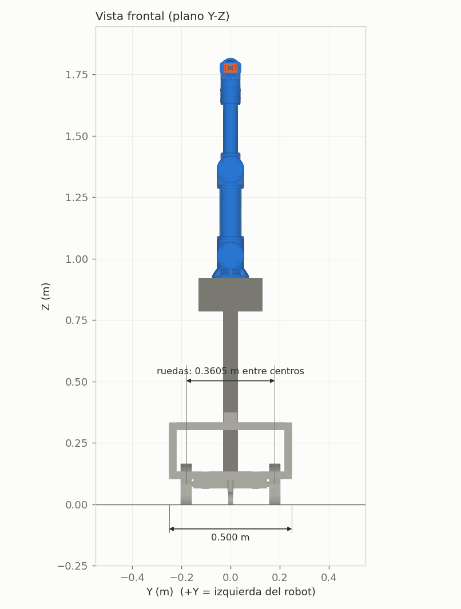
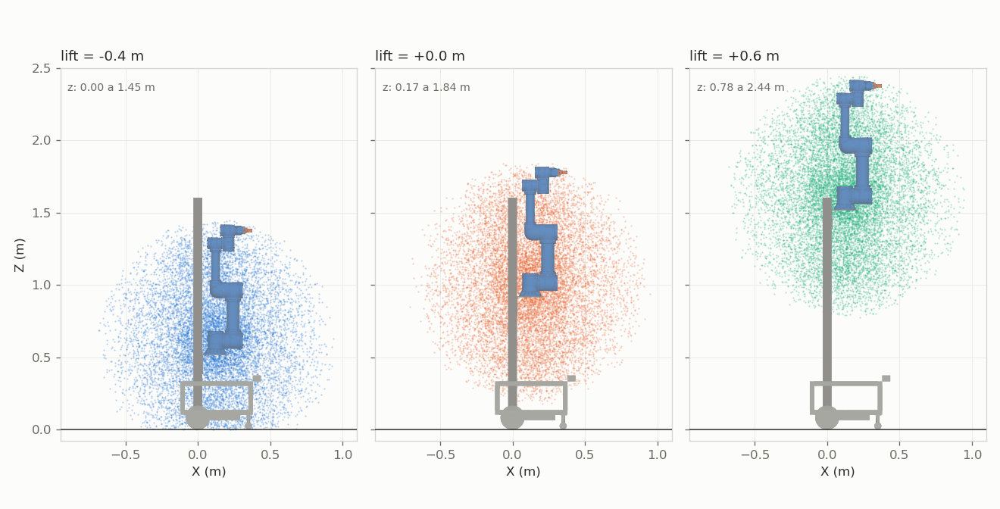
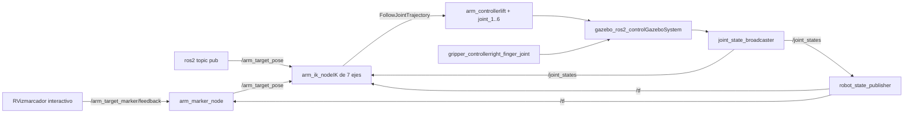
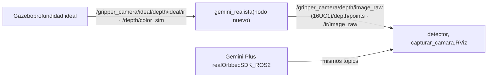
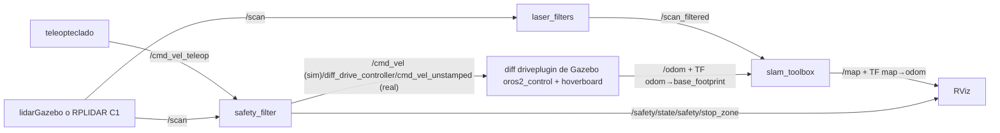

*milo_ws · ROS 2 Humble · Gazebo classic 11 · Docker*

# Milo: el brazo y su workspace

Informe técnico de `milo_ws` centrado en el brazo de Milo: su modelo, su hardware real, la cinemática, el control en Gazebo y la cámara de la pinza. También explica cómo se ejecuta el workspace (Docker y scripts) y resume, como contexto, la base móvil, que desarrolla otro equipo. Todos los valores están tomados del código y de pruebas corridas sobre él.

**Fecha:** 6 de octubre de 2026 · **Alcance:** los 7 paquetes de `ros2_ws/src`, Docker y los scripts · **Rama:** `brazo` (base: `72fc3a1 Workspace de Milo`)

| Dato | Qué es |
| ---: | --- |
| **6 + 1** | ejes en la cinemática inversa: 6 del brazo + el lift |
| **0 – 2.46 m** | alturas del TCP con brazo + lift; 0.97 m de alcance al frente |
| **8.05 kg** | brazo con motores y pinza en ABS (4.42 kg en el CAD original) |
| **4 canales** | de la cámara de la pinza: color, profundidad, nube de puntos e infrarrojo |

## Contenido

**I · El proyecto**

1. [Qué es Milo y qué hay aquí](#alcance)
2. [Docker y scripts](#docker)
3. [Paquetes y flujo de datos](#arquitectura)

**II · El brazo**

4. [Modelo del robot y medidas](#modelo)
5. [Cadena cinemática](#cadena)
6. [Hardware real y masas del brazo](#hardware)
7. [Cinemática directa](#fk)
8. [Punto de agarre (TCP)](#tcp)
9. [Jacobiano](#jacobiano)
10. [Cinemática inversa](#ik)

**II · El brazo (cont.)**

11. [Inclusión del lift (7 ejes)](#lift)
12. [Espacio de trabajo y rango con el lift](#workspace)
13. [El brazo en simulación](#brazo-sim)
14. [Cámara de profundidad en la pinza](#camara)
15. [Dónde se usan estos métodos hoy](#aplicaciones)

**III · Base móvil**

16. [Simulación en Gazebo](#gazebo)
17. [Masas y estabilidad de la base](#masas-base)
18. [Milo físico](#fisico)
19. [Filtro de seguridad](#seguridad)
20. [Mapeo (SLAM)](#slam)

**IV · Estado**

21. [Validación](#validacion)
22. [Problemas y soluciones](#problemas)
23. [Pendientes](#pendientes)
24. [Cómo usarlo](#uso)

# Parte I · El proyecto

*Qué es Milo, cómo está organizado el workspace y cómo se ejecuta.*

<a id="alcance"></a>

## 1. Qué es Milo y qué hay aquí

Milo (`andesrobot`) es un manipulador móvil: una base diferencial con ruedas y electrónica de hoverboard, un RPLIDAR C1, una IMU, una columna vertical con un carro que sube y baja (el *lift*), un brazo de 6 articulaciones rotativas y una pinza de dos dedos.

`milo_ws` es el workspace del equipo. Contiene todo lo necesario para dos modos de trabajo con los mismos topics: **simulación** en Gazebo (en cualquier PC) y **robot físico** (en el portátil que va sobre Milo). Lo que funciona hoy:

- **Base:** teleoperación con teclado, filtro de seguridad que frena ante obstáculos y mapeo 2D con slam_toolbox. En simulación y en el robot real.
- **Brazo:** cinemática directa e inversa (con el lift), control de brazo, lift y pinza en Gazebo, y un marcador en RViz para moverlo con el mouse. **Solo en simulación**: aún no hay driver del brazo real.

La documentación del repositorio está en español y pensada para estudiantes: cada launch, xacro, YAML y script explica sus conceptos en comentarios. El `README.md` es un paso a paso; los detalles por paquete están en `andesrobot_description/docs/ROBOT.md` y `andesrobot_arm/docs/BRAZO.md`.

### Estado del repositorio

| Commit / cambio | Contenido |
| --- | --- |
| `72fc3a1` | Workspace de Milo: base, Gazebo, seguridad, SLAM, driver del hoverboard, Docker |
| `0fbd9af` | Brazo: cinemática inversa con lift, control en Gazebo y marcador en RViz |
| `13cab44` | Documentación del brazo: CLAUDE.md, figuras y medidas generadas del URDF |
| `acce081` | Figura de la cadena con el lift: desplazamiento de cada tramo y rango del elevador |
| `653215a` | Índice del hardware real (EB300, EBG-20, motores, Gemini Plus); los documentos de terceros quedan fuera de git |
| `92805c5 · 5a79704` | Copia local de este informe (hoy en `docs/informe/`) y vista de RViz del brazo |
| `6e52d7d` | Masas reales del brazo (sección 6) y cámara de la pinza (sección 14) |
| `e578acc` | Estructura del repo: `docs/` en la raíz (informe y documentación del hardware) y drivers externos en `docker/milo.repos` |
| `7261aa5` | Tolerancias de meta del brazo y correcciones de la auditoría |
| (este cambio) | El informe pasa a Markdown (`docs/informe/README.md`) para leerlo directo en GitHub |

La rama está en GitHub: `github.com/Ivan1721/milo_ws`, rama `brazo` (repositorio público; el remoto usa SSH). En la raíz, `docs/` guarda lo que no es código: `docs/informe/`, este informe, y `docs/hardware/`, los manuales y modelos de las piezas (de terceros: solo su índice va a git). `ros2_ws/src/` queda solo para paquetes de ROS.

<a id="docker"></a>

## 2. Docker y scripts

Todo corre dentro de un contenedor para que cualquier PC con Docker tenga el mismo entorno. La carpeta `ros2_ws/` del PC se monta en el contenedor como `/ros2_ws`: el código se edita en el PC y se compila y ejecuta adentro. Lo compilado (`install/`) y los mapas quedan en el PC aunque el contenedor se borre.

### Imagen `milo:humble`

- Base `osrf/ros:humble-desktop` + Gazebo ROS, xacro, RViz, slam_toolbox, nav2_map_server, laser_filters, teleop_twist_keyboard, ros2_control, ros2_controllers y gazebo_ros2_control.
- Driver del lidar `sllidar_ros2` de Slamtec, compilado en `/opt/milo_drivers`. Su versión (commit `3430009`) está fijada en `docker/milo.repos`, el archivo donde se listan los drivers externos que se descargan al construir la imagen.
- Usuario `ros` con el mismo UID/GID que el usuario del PC, para que los archivos compilados no queden a nombre de root. Pertenece a `video` y `dialout` (GPU y puertos serie).

### Capas de docker compose

| Archivo | Cuándo se usa | Qué agrega |
| --- | --- | --- |
| `compose.yaml` | siempre | contenedor `milo`, red e IPC del host (ROS 2 se ve en la red), X11 para ventanas, `/dev/dri`, montaje de `ros2_ws`, caché de modelos de Gazebo |
| `compose.nvidia.yaml` | si hay `nvidia-smi` y el runtime de NVIDIA, salvo con `cpu` o `software` | la GPU NVIDIA |
| `compose.robot.yaml` | `robot.sh` | modo privilegiado y `/dev` completo (USB del lidar y del hoverboard) |

### Comandos

`sim.sh` y `robot.sh` comparten las funciones de `docker/lib.sh`. Si el workspace nunca se compiló, lo compilan al arrancar.

| Comando | Qué hace |
| --- | --- |
| `./sim.sh` | Gazebo + Milo (brazo bloqueado) + filtro de seguridad + slam_toolbox + RViz |
| `./sim.sh brazo` | Gazebo + Milo con brazo, lift y pinza controlados + IK + marcador en RViz |
| `./sim.sh cpu · software · sin-gazebo` | sin NVIDIA · render por CPU (si las ventanas se ven negras) · sin ventana de Gazebo |
| `./sim.sh gpu` | muestra con qué tarjeta dibuja el contenedor (`llvmpipe` = CPU) |
| `./sim.sh teleop` | teclado → `/cmd_vel_teleop` (entrada del filtro de seguridad) |
| `./sim.sh mapa [nombre]` | guarda el mapa en `andesrobot_slam/maps/` (.pgm + .yaml) |
| `./sim.sh shell · build · stop` | terminal en el contenedor · `colcon build --symlink-install` · apagar el contenedor |
| `./robot.sh` | Milo físico: hoverboard + lidar + filtro + slam_toolbox (+ RViz si hay pantalla). Puertos con `LIDAR=… HOVER=…` |
| `./robot.sh puertos · rviz` | lista los USB conectados (para las reglas udev) · RViz de mapeo, en Milo o en otro PC de la misma red |

> **No compilar con `colcon build` fuera de Docker dentro de `ros2_ws`.** El contenedor reutiliza `ros2_ws/install/` y un build del PC deja rutas que no existen adentro. Para correr sin Docker se compila en otra carpeta (`--build-base /tmp/milo_build --install-base /tmp/milo_install`).

Con `--symlink-install`, los `.py`, `.xacro` y `.yaml` editados se toman al relanzar; solo los archivos nuevos y el código C++ exigen `./sim.sh build`.

<a id="arquitectura"></a>

## 3. Paquetes y flujo de datos

| Paquete | Función |
| --- | --- |
| `andesrobot_description` | URDF/xacro, mallas STL, `rsp.launch.py`, `display.launch.py` (RViz con sliders). Única fuente de la geometría. |
| `andesrobot_gazebo` | `sim.launch.py` (mundo + robot_state_publisher + spawn, brazo bloqueado) y la arena de mapeo |
| `andesrobot_bringup` | launches de nivel superior: `sim_mapping`, `robot`, `robot_mapping`, `rviz_mapping`; controladores de la base real |
| `andesrobot_safety` | `safety_filter`: frena antes de los obstáculos. Matemática en `logic.py` (con pruebas) |
| `andesrobot_slam` | `laser_filters` (quita la columna del scan) + slam_toolbox, y la carpeta de mapas |
| `andesrobot_arm` | cinemática e IK, nodos `arm_ik_node` y `arm_marker_node`, controladores y launch del brazo en Gazebo, figuras |
| `drivers/hoverboard_hardware_interface` | plugin C++ de ros2_control para las ruedas reales (puerto serie) |

Este informe sigue ese orden de prioridad: la **Parte II** es el brazo (el trabajo de este equipo), con su modelo, su hardware, su cinemática, su simulación y la cámara de la pinza. La **Parte III** resume la base móvil, que desarrolla otro equipo, como contexto. El flujo de datos del brazo está en la [sección 13](#brazo-sim) y el de la base en la [sección 16](#gazebo).

# Parte II · El brazo

*El trabajo de este equipo: modelo, hardware, cinemática, simulación y la cámara de la pinza.*

<a id="modelo"></a>

## 4. Modelo del robot y medidas

El modelo es `andesrobot.urdf.xacro`, que incluye otros archivos: colores y fricción (`materials`, `gazebo`), plugins de simulación (`sim`), el ros2_control de las ruedas reales (`ros2_control`) y el del brazo en Gazebo (`arm_control`). Sigue REP-103/105: +X adelante, +Y izquierda, +Z arriba.

En Fusion el robot se modeló girado 180° en Z. Por eso las uniones a nivel de la base llevan `rpy="0 0 π"` y las mallas tienen *origins* que las devuelven a su sitio (Fusion exporta cada malla en coordenadas del ensamblaje).

### Frames principales

| Frame | Dónde | Lo usan |
| --- | --- | --- |
| `base_footprint` | suelo, bajo el centro del eje de las ruedas; raíz del árbol | odometría, SLAM, filtro de seguridad, IK con lift |
| `base_link` | centro del eje de ruedas, z = 0.08255 m | chasis, ruedas, sensores |
| `laser` | centro óptico del C1: x = 0.408, z = 0.363 m | lidar (mismo frame en sim y real) |
| `imu_link_1` | x = 0.13, z = 0.103 m | IMU |
| `arm_base_link_1` | sobre el carro del lift; x = 0.1225, z = 0.920 m con el lift en 0 | IK de 6 ejes |
| `gripper_tcp` | 0.102 m hacia −X de `link_6_1`, entre los dedos | punta de la IK y marcador |

### Argumentos del xacro

| Argumento | Defecto | Efecto |
| --- | --- | --- |
| `lock_arm` | false | true = brazo, lift y dedos `fixed`. Lo usa la simulación de mapeo: sin motores, el brazo se desplomaría |
| `simple_collision` | false | true = cajas en vez de mallas, incluida una caja fija para el brazo (los eslabones del brazo quedan sin colisión) |
| `sim_lidar / sim_imu` | true | apagar sensores simulados para depurar |
| `use_hardware / hoverboard_port` | false / `/dev/hoverboard` | agrega el ros2_control del hoverboard (robot real) |
| `arm_control / arm_controllers_file` | false / vacío | brazo, lift y pinza con ros2_control en Gazebo |
| `gripper_camera` | false | cámara Orbbec Gemini Plus sobre la pinza, con sus sensores en Gazebo (sección 14) |


**Figura 1.** Modelo 3D generado a partir de las mallas de `andesrobot_description` (brazo en azul, pinza en naranja, columna y base en gris). Postura de ejemplo: joint_2 = 0.35, joint_3 = 0.9, joint_5 = 0.6 rad.

<p>


</p>

**Figura 2.** Vista lateral (X-Z), brazo en cero y lift en 0. El frente está a la derecha; el eje de las ruedas en x = 0.

**Figura 3.** Vista frontal (Y-Z). +Y es la izquierda del robot.

**Método de medición:** el script `andesrobot_arm/scripts/figuras.py` coloca cada malla STL donde la pone el URDF y toma los extremos de sus vértices. Un vértice $`\mathbf v`$ (en mm) del eslabón $`L`$ queda en el mundo en:

```math
\mathbf p_w = {}^{w}T_{L}(\mathbf q)\; T_{\text{vis}}\; \begin{bmatrix} s\,\mathbf v \\ 1 \end{bmatrix}, \qquad s = 0.001\ \text{m/mm}
```

$`{}^{w}T_{L}`$ es la pose del eslabón (cinemática directa, sección 7) y $`T_{\text{vis}}`$ el `<visual><origin>` del URDF. Las dimensiones son $`\max_i p_{w,i} - \min_i p_{w,i}`$ en cada eje.

### Medidas

| Medida | Valor | Nota |
| --- | ---: | --- |
| Largo (X) | 0.556 m | de −0.120 a +0.436 m (el frente es el lidar) |
| Ancho (Y) | 0.500 m | de −0.250 a +0.250 m |
| Altura, brazo vertical, lift en 0 / −0.4 / +0.6 m | 1.816 / 1.603 / 2.416 m | con el lift abajo, lo más alto es la columna |
| Altura de la base | 0.374 m | hasta el lidar; el chasis llega a 0.333 m |
| Rueda: diámetro / radio / ancho | 0.1651 / 0.08255 / 0.045 m | rueda de hoverboard de 6.5" |
| Separación entre ruedas | 0.3604 m | centro a centro de la banda (las mallas dan 0.3605; 0.3155 es entre orígenes de los joints) |
| Rueda loca | x = 0.35 m | radio de colisión 0.025 m, provisorio |
| Columna | 6 × 6 cm | sobre el eje de ruedas, de z = 0.103 a 1.603 m |
| Carrera del lift | −0.4 a +0.6 m | 150 N, 0.20 m/s; base del brazo entre z = 0.520 y 1.520 m |

<a id="cadena"></a>

## 5. Cadena cinemática

El trabajo del brazo empezó en un workspace aparte (`preparacion_ws`) y se migró a `milo_ws`, cuya descripción tiene exactamente la misma cadena del brazo. No se duplicó el URDF: se agregó lo necesario a `andesrobot_description` y el resto va en `andesrobot_arm`.

La cadena va de `arm_base_link_1` a `gripper_tcp`. Cada articulación tiene un desplazamiento fijo (`origin`) respecto al eslabón anterior y un eje de giro:

| Articulación | Tipo | Desplazamiento xyz (m) | Distancia | Eje local | Eje en el mundo (q = 0) | Límites |
| --- | --- | --- | ---: | --- | --- | --- |
| `vertical_lift_joint` | prismática | `(−0.06, 0, 0.75)` | — | `+Z` | `+Z` | −0.4 … 0.6 m |
| `joint_1` | rotativa | `(0, 0, 0.037)` | 0.037 m | `+Z` | `+Z` | ±π (provisorio) |
| `joint_2` | rotativa | `(−0.065, 0, 0.056)` | 0.086 m | `−X` | `+X` | ±π (provisorio) |
| `joint_3` | rotativa | `(−0.001077, 0, 0.350077)` | **0.350 m** | `+X` | `−X` | ±π (provisorio) |
| `joint_4` | rotativa | `(0.026, 0, 0.3235)` | **0.325 m** | `−X` | `+X` | ±π (provisorio) |
| `joint_5` | rotativa | `(−0.0495, 0, 0.04)` | 0.064 m | `+Z` | `+Z` | ±π (provisorio) |
| `joint_6` | rotativa | `(−0.041, 0, 0.0495)` | 0.064 m | `−X` | `+X` | ±π (provisorio) |
| `gripper_tcp_joint` | fija | `(−0.102, 0, 0)` | 0.102 m | — | — | — |

El eje en el mundo difiere del local por la corrección de 180° en Z de la base. El brazo mide 0.350 m (joint_2 → joint_3) y el antebrazo 0.325 m (joint_3 → joint_4). Los límites provisorios están en las propiedades `arm_lower`, `arm_upper`, `arm_effort` (20 N·m) y `arm_velocity` (1 rad/s).


**Figura 4.** Cadena de 7 ejes con el brazo en cero, proyectada en X-Z. **Izquierda:** la cadena en las tres alturas del lift (−0.4, 0 y +0.6 m), la carrera de 1.000 m medida en el origen de `vertical_lift_joint`, la altura del TCP sobre el suelo en cada caso y el desplazamiento total lift → TCP, que no cambia con la altura. **Derecha:** cada tramo con ΔX, ΔZ y su distancia; entre paréntesis, el eje de giro en el marco del mundo. Con el brazo en cero todos los ΔY son 0. Generada por `scripts/figuras.py`.

- Con joint_1 = 0, los ejes de joint_2, 3, 4 y 6 son paralelos a X: el brazo se dobla en el plano Y-Z (hacia los lados). Para trabajar al frente, joint_1 tiene que girar.
- La muñeca **no es esférica**: joint_4 y joint_6 son paralelos y están a unos 9 cm. No hay solución cerrada de la cinemática inversa; se usa un método numérico (sección 10).

### Distancias entre articulaciones en coordenadas globales

En la cadena de 7 ejes el prismático es la primera articulación: en el código se llama `vertical_lift_joint`, y `joint_1` es la base giratoria. Las posiciones están en `base_footprint` (suelo bajo el eje de las ruedas), con todas las articulaciones en 0 y el lift en 0. En esa pose el brazo apunta hacia arriba y la pinza hacia +X.

| Punto | X (m) | Y (m) | Z (m) |
| --- | ---: | ---: | ---: |
| `vertical_lift_joint` | 0.0300 | 0 | 0.8528 |
| `joint_1` | 0.1225 | 0 | 0.9573 |
| `joint_2` | 0.1875 | 0 | 1.0133 |
| `joint_3` | 0.1886 | 0 | 1.3634 |
| `joint_4` | 0.1626 | 0 | 1.6869 |
| `joint_5` | 0.2121 | 0 | 1.7269 |
| `joint_6` | 0.2531 | 0 | 1.7764 |
| `gripper_tcp` | 0.3551 | 0 | 1.7764 |

Cada tramo se descompone en dos partes. La parte **perpendicular** a los ejes es el largo útil del eslabón. La parte **a lo largo del eje** es un desplazamiento que corre el plano en que trabaja el brazo. Cuando dos ejes se cortan, no hay largo perpendicular.

| Tramo | ΔX | ΔY | ΔZ | Distancia | Ejes | Largo útil / desplazamiento |
| --- | ---: | ---: | ---: | ---: | --- | --- |
| `lift → joint_1` | 0.0925 | 0 | 0.1045 | 0.1396 | paralelos (Z) | 0.0925 horizontal hasta el eje de joint_1; 0.1045 vertical |
| `joint_1 → joint_2` | 0.0650 | 0 | 0.0560 | 0.0858 | se cortan (Z, X) | 0.056 de altura; 0.065 corre el plano del brazo respecto al eje de joint_1 |
| `joint_2 → joint_3` | 0.0011 | 0 | 0.3501 | 0.3501 | paralelos (X) | **0.3501 brazo**; 0.0011 a lo largo del eje |
| `joint_3 → joint_4` | −0.0260 | 0 | 0.3235 | 0.3245 | paralelos (X) | **0.3235 antebrazo**; −0.026 a lo largo del eje |
| `joint_4 → joint_5` | 0.0495 | 0 | 0.0400 | 0.0636 | se cortan (X, Z) | 0.0495 a lo largo de joint_4; 0.040 a lo largo de joint_5 |
| `joint_5 → joint_6` | 0.0410 | 0 | 0.0495 | 0.0643 | se cortan (Z, X) | 0.0495 a lo largo de joint_5; 0.041 a lo largo de joint_6 |
| `joint_6 → gripper_tcp` | 0.1020 | 0 | 0 | 0.1020 | sobre el eje de joint_6 | 0.102: el TCP está en el eje de giro de la pinza |

### Totales hasta la pinza

| Desde | ΔX | ΔY | ΔZ | En línea recta (pose cero) | Suma de tramos |
| --- | ---: | ---: | ---: | ---: | ---: |
| `vertical_lift_joint` (prismático) | 0.3251 | 0 | 0.9236 | 0.9791 | 1.1299 |
| `joint_1` (base giratoria) | 0.2326 | 0 | 0.8191 | 0.8515 | 0.9903 |
| `joint_2` (hombro) | 0.1676 | 0 | 0.7631 | 0.7813 | 0.9045 |

La distancia más grande que puede haber entre el hombro y el TCP es **0.843 m** (buscada en todas las posturas). Es menor que la suma de tramos (0.905 m) porque los desplazamientos a lo largo de los ejes y la muñeca no se alinean nunca en una sola recta. En la pose cero, ΔY = 0 porque con joint_1 = 0 el brazo se dobla en el plano Y-Z: la componente Y aparece al mover joint_2 y joint_3.

### Comparación con el DH oficial del EB300

La página del fabricante publica los parámetros Denavit-Hartenberg del EB300 (imagen guardada en `docs/hardware/brazo_eb300/carrusel/`). Midiendo las mismas distancias entre ejes en el URDF:

| Parámetro DH | Qué mide | URDF | EB300 |
| --- | --- | ---: | ---: |
| `d₁` | base → eje del hombro | 93.0 mm | 95 mm |
| `a₂` | brazo (hombro → codo) | 350.1 mm | 348 mm |
| `a₃` | antebrazo (codo → muñeca 1) | 323.5 mm | 318 mm |
| `d₄` | desplazamiento lateral del eje de joint_1 al de la muñeca 2 | **89.6 mm** | **122 mm** |
| `d₅` | eje de la muñeca 1 → eje de la muñeca 3 | **89.5 mm** | **99 mm** |
| `d₆` | eje de la muñeca 2 → brida | **41 mm** | **57 mm** |

El brazo y el antebrazo coinciden con el EB300 a pocos milímetros, pero la muñeca del CAD es más compacta: 32 mm menos de desplazamiento lateral y 10–16 mm menos entre ejes. La cinemática no se cambió: hay que decidir cuál representa el brazo real, idealmente midiéndolo.

> **Los orígenes están en los acoplamientos.** Cada `origin` del URDF es el punto donde Fusion definió la unión entre dos piezas, no necesariamente el centro del motor. Sobre el propio eje, ese punto no cambia el movimiento. Pero los desplazamientos a lo largo de los ejes (0.065, 0.0011, −0.026, 0.0495, 0.041 m) sí corren el plano del brazo, así que conviene confirmarlos en el robot real.

<a id="hardware"></a>

## 6. Hardware real y masas del brazo

El CAD de Fusion describe la forma del brazo, pero no su hardware: los motores no están, y cada masa es la pieza maciza con el material que tenía asignado en el CAD. Esta sección reúne el hardware real (brazo EB300, pinza EBG-20) y cómo se corrigieron las masas del URDF. Los documentos de cada pieza están en `docs/hardware/` (en la raíz del repo).

### Brazo real: EB300 de Toolbox Robotics

Brazo colaborativo de 6 ejes impreso en 3D (PLA+, ABS o PA-CF), con tubos de ABS de 3" y 2". Ninguno de sus componentes de hardware está en las masas del URDF:

| Articulación | Motor (guía eléctrica) | Torque de retención | Corriente | Masa del motor |
| --- | --- | ---: | ---: | ---: |
| `joint_1` | NEMA23 82 mm + reductor EBA-23 | 2.4 N·m | 4.0 A | ≈ 1.1 kg |
| `joint_2` | NEMA23 82 mm + reductor EBA-23 | 2.4 N·m | 4.0 A | ≈ 1.1 kg |
| `joint_3` | NEMA23 76 mm + reductor EBA-23 | 1.85 N·m | 2.8 A | ≈ 1.07 kg |
| `joint_4 · joint_5 · joint_6` | NEMA17 60 mm + reductor EBA-17 | 0.65 N·m | 2.1 A | ≈ 0.41 kg c/u |
| **Motores sin reductores** |  |  |  | **≈ 4.5 kg** |

El motor de cada articulación sale de la guía eléctrica del fabricante (págs. 22–27); torque y corriente, de su documento de ensamblaje (pág. 4). Control: Arduino MEGA 2560 + 6 drivers TB6600 + fuente 24 V 15 A, que van en la base, no en el brazo.

Masas: el datasheet del NEMA23 de 82 mm (23HS32-4004S, que coincide en 2.4 N·m y 4.0 A) no trae la masa, así que se extrapoló. Las otras dos salen de las tablas de los datasheets CUI/LIN del proyecto para el largo de cuerpo más cercano (3.10" → 2.35 lb; 2.34" → 0.90 lb). Los documentos del fabricante no traen modelo Denavit-Hartenberg ni medidas de los eslabones. Todo está guardado en `docs/hardware/` (en la raíz del repo).

> **Solo los motores pesan más que todo el brazo del URDF (4.42 kg),** y faltan los reductores EBA. Los NEMA23 van en las tres primeras articulaciones, las que más cargan.

### Gripper real: EBG-20 de Toolbox Robotics

Pinza paralela de piñón y cremalleras, movida por un servo MG99x (en la lista de materiales: "MG99 or +"). Sus planos y mallas confirman que es el gripper del URDF: el cuerpo mide 85 × 65 × 52 mm, igual que `link_6_1` (85 × 65 mm en Y-Z), y las piezas de cada dedo suman 21.1 cm³, exactamente el volumen de cada dedo del URDF.

| EBG-20 | Valor | Cómo sale |
| --- | ---: | --- |
| Piezas impresas (15) | 156 cm³ | volumen de sus mallas STL |
| Masa impresa en ABS, maciza | 0.17 kg | 156 cm³ × 1.06 g/cm³; con relleno parcial pesa menos |
| Servo MG99x + tornillos e insertos M3/M4 | ≈ 0.07 kg | servo MG996R típico ≈ 55 g |
| **Gripper completo, estimado** | **≤ 0.23 kg** | **máximo, con piezas macizas; contra **1.07 kg** en el URDF** |

### Con qué densidad calculó Fusion las masas

Dividiendo la masa de cada link por el volumen de su malla se ve qué material tenía asignado en el CAD:

| Links | Densidad | Material que corresponde | Consecuencia |
| --- | ---: | --- | --- |
| base, columna, ruedas, carro del lift, `arm_base_link_1`, `link_1_1` … `link_5_1` | 1.06 g/cm³ | ABS, **macizo** (100 % de relleno) | Las piezas impresas con relleno parcial pesan menos; los tubos, perfiles y metales no están representados |
| `link_6_1` y los dos dedos (el gripper) | 7.85 g/cm³ | **acero**: el material por defecto de Fusion | El gripper pesa 1.07 kg en el URDF; impreso en ABS pesa menos de 0.23 kg |

### Masas corregidas en el URDF

Las tablas de arriba son las masas originales del CAD. En `andesrobot.urdf.xacro` ya están corregidas:

- **Pinza:** masa e inercia de `link_6_1` y los dedos multiplicadas por 1.06 / 7.85 (de acero a ABS, propiedad `gripper_mass_scale`): de 1.07 a 0.144 kg. El servo (55 g) va en el cuerpo de la pinza.
- **Motores:** cada uno es un link fijo con solo masa e inercia (`motor_joint_1` … `motor_joint_6`), en el eslabón **anterior** a la articulación que mueve y sobre su eje, como muestran las vistas explosionadas del fabricante. Gazebo funde los links fijos con su padre, así que la masa, el centro de masa y la inercia del eslabón quedan bien sin tocar los valores del CAD. Las masas son propiedades (`nema23_82_mass`, …) con su fuente en los comentarios.
- **Reductores EBA:** en 0 hasta tener sus modelos.

|  | CAD | Corregido |
| --- | ---: | ---: |
| Pinza (`link_6_1` + dedos + servo) | 1.070 kg | 0.199 kg |
| Motores | — | 4.500 kg |
| **Brazo completo** | **4.42 kg** | **8.05 kg** |
| **Robot completo** | **30.39 kg** | **34.02 kg** |

Con las masas nuevas la cadena de la IK no cambia, las 6 pruebas pasan, y en Gazebo la pinza sigue llegando a las poses de prueba con menos de 0.1 mm de error. Queda pendiente pesar las piezas impresas reales y recalcular los torques de joint_2 y joint_3 para reemplazar el límite provisorio de 20 N·m.

<a id="fk"></a>

## 7. Cinemática directa

**Para qué:** calcular dónde queda la pinza dados los ángulos. La usan la inversa, el Jacobiano, las mediciones y las figuras.

**Método:** producto de transformaciones homogéneas leídas del URDF procesado (`ArmKinematics` en `kinematics.py`, solo numpy). No hay tabla Denavit-Hartenberg: el código recorre el URDF desde la punta hasta la base, así que un cambio en el xacro se refleja solo. Lee el xacro **instalado** con `lock_arm:=false`.

```math
{}^{b}T_{e}(\mathbf q) \;=\; \prod_{i=1}^{n} T_{o,i}\; M_i(q_i)
```

$`T_{o,i}`$ es el `origin` fijo de la articulación $`i`$ y $`M_i(q_i)`$ su movimiento. Las articulaciones fijas aportan solo $`T_{o,i}`$.

```math
T_{o} = \begin{bmatrix} R_{\text{rpy}} & \mathbf t \\ \mathbf 0^\top & 1 \end{bmatrix}, \qquad R_{\text{rpy}}(\phi,\theta,\psi) = R_z(\psi)\,R_y(\theta)\,R_x(\phi)
```

Convención URDF: *roll* $`\phi`$, *pitch* $`\theta`$, *yaw* $`\psi`$, en ejes fijos.

```math
M_i^{\text{rot}}(q) = \begin{bmatrix} I + \sin q\,[\mathbf k]_\times + (1-\cos q)\,[\mathbf k]_\times^2 & \mathbf 0 \\ \mathbf 0^\top & 1 \end{bmatrix}, \qquad M_i^{\text{pris}}(d) = \begin{bmatrix} I & d\,\mathbf k \\ \mathbf 0^\top & 1 \end{bmatrix}
```

Fórmula de Rodrigues para articulaciones rotativas con eje unitario $`\mathbf k`$; traslación a lo largo de $`\mathbf k`$ para las prismáticas (el lift). $`[\mathbf k]_\times`$ es la matriz antisimétrica del producto cruz.

Con todo en cero, el TCP queda en $`(-0.2326,\ 0,\ 0.8561)`$ m respecto a `arm_base_link_1` (lo comprueba una prueba) y en $`(0.3551,\ 0,\ 1.7764)`$ m respecto a `base_footprint` con el lift en 0.

<a id="tcp"></a>

## 8. Punto de agarre (TCP)

Cuando se manda una pose, lo que llega a ella es el TCP. El origen de `link_6_1` está 10 cm detrás de los dedos; el TCP es el centro de la zona de agarre. Se midió colocando las mallas de los dedos en el marco de `link_6_1` y analizándolas por cortes a lo largo de X.

| Resultado (marco link_6_1) | Valor |
| --- | ---: |
| Dirección en la que apunta la pinza | −X |
| Punta de los dedos | x = −0.1224 m |
| Cara interna de los dedos (contacto) | x = −0.083 a −0.121 m |
| Dedo derecho / izquierdo en la punta | y ∈ [0.0085, 0.019] / [−0.019, −0.0085] m |
| Simetría en Z | z ∈ [−0.0106, 0.0104] m |
| Dirección de cierre | eje Y |
| **TCP elegido** (mitad de la cara de contacto) | **(−0.102, 0, 0) m** |

```math
g(q_f) = 0.017 + 2\,q_f \quad\Rightarrow\quad g \in [0.003,\ 0.049]\ \text{m para } q_f \in [-0.007,\ 0.016]\ \text{m}
```

Apertura entre las caras internas en función de `right_finger_joint`; el izquierdo lo imita con multiplicador −1 (*mimic*). Con $`q_f = 0`$ quedan 17 mm.

En el xacro, `gripper_tcp` es un eslabón sin masa unido a `link_6_1` por una articulación fija. Para poner el TCP en la punta de los dedos basta cambiar su `origin` a −0.1224.

<a id="jacobiano"></a>

## 9. Jacobiano

Relaciona velocidades articulares con la velocidad del TCP; la cinemática inversa lo usa en cada iteración. Es el Jacobiano geométrico, calculado a partir de los marcos de cada articulación.

```math
J = \begin{bmatrix} J_v \\ J_\omega \end{bmatrix} \in \mathbb R^{6\times n}, \qquad
       J_i = \begin{cases} \begin{bmatrix} \mathbf z_i \times (\mathbf p_e - \mathbf p_i) \\ \mathbf z_i \end{bmatrix} & \text{rotativa} \\[10pt] \begin{bmatrix} \mathbf z_i \\ \mathbf 0 \end{bmatrix} & \text{prismática} \end{cases}
```

$`\mathbf z_i = R_i\,\mathbf k_i`$ es el eje de la articulación $`i`$ en el marco base, $`\mathbf p_i`$ su posición y $`\mathbf p_e`$ la del TCP.

```math
J_{v,i} \approx \frac{\mathbf p_e(\mathbf q + h\,\mathbf e_i) - \mathbf p_e(\mathbf q - h\,\mathbf e_i)}{2h}, \qquad h = 10^{-6}
```

Verificación: la parte lineal coincide con diferencias finitas centradas con tolerancia $`10^{-8}`$. La parte angular se valida de forma indirecta con las pruebas de cinemática inversa.

<a id="ik"></a>

## 10. Cinemática inversa

Dada una pose deseada $`T_d = (R_d, \mathbf p_d)`$, encontrar $`\mathbf q`$. Como la muñeca no es esférica, se usa mínimos cuadrados amortiguados (*damped least squares*, DLS), un método iterativo que se comporta bien cerca de singularidades.

### Error de pose

```math
\mathbf e = \begin{bmatrix} \mathbf e_p \\ \mathbf e_R \end{bmatrix} = \begin{bmatrix} \mathbf p_d - \mathbf p(\mathbf q) \\ \log\!\big(R_d\,R(\mathbf q)^\top\big)^\vee \end{bmatrix}
```

El error de orientación es el vector de rotación (eje × ángulo) que lleva la orientación actual a la deseada.

```math
\theta = \arccos\!\left(\frac{\operatorname{tr} R - 1}{2}\right), \qquad
       \log(R)^\vee = \frac{\theta}{2\sin\theta}\begin{bmatrix} R_{32}-R_{23} \\ R_{13}-R_{31} \\ R_{21}-R_{12} \end{bmatrix}
```

Si $`\theta \approx 0`$ el resultado es cero; si $`\theta \approx \pi`$ el eje se obtiene de la parte simétrica de $`R`$, porque la fórmula se indefine.

### Paso de actualización (DLS ponderado)

```math
\Delta\mathbf q = W^{-1} J^\top \left( J\,W^{-1} J^\top + \lambda^2 I \right)^{-1} \mathbf e
```

Solución de $`\min_{\Delta\mathbf q}\ \lVert J\Delta\mathbf q - \mathbf e\rVert^2 + \lambda^2\,\Delta\mathbf q^\top W \Delta\mathbf q`$. $`\lambda`$ evita pasos enormes cerca de singularidades. $`W = \operatorname{diag}(w_i)`$ da un costo a cada articulación: una con más peso se mueve menos.

```math
\Delta\mathbf q \leftarrow \Delta\mathbf q \cdot \min\!\left(1,\ \frac{\Delta_{\max}}{\lVert \Delta\mathbf q \rVert}\right), \qquad \mathbf q \leftarrow \operatorname{lim}(\mathbf q + \Delta\mathbf q)
```

```math
\operatorname{lim}(q_i) = \begin{cases} \big((q_i - q_i^{\min}) \bmod 2\pi\big) + q_i^{\min} & \text{rotativa con } q_i^{\max} - q_i^{\min} \ge 2\pi \\ \operatorname{clip}(q_i,\ q_i^{\min},\ q_i^{\max}) & \text{otra con límites} \end{cases}
```

Con rangos de vuelta completa (los ±π provisorios) el ángulo da la vuelta en vez de recortarse; si no, una solución cerca de −π se quedaba pegada al límite.

### Convergencia y reinicios

Se itera hasta $`\lVert\mathbf e_p\rVert < 10^{-4}`$ m y $`\lVert\mathbf e_R\rVert < 10^{-3}`$ rad. El primer intento parte de la posición actual, para que la solución quede cerca. Si no converge, se reintenta desde configuraciones aleatorias dentro de los límites. Si ninguno converge, se devuelve el mejor (menor $`\lVert\mathbf e_p\rVert + 0.1\,\lVert\mathbf e_R\rVert`$) marcado como fallido y el nodo no mueve el brazo.

| Parámetro | Valor | Efecto |
| --- | ---: | --- |
| Amortiguamiento $`\lambda`$ | 0.01 | estabilidad cerca de singularidades |
| Paso máximo $`\Delta_{\max}`$ | 0.5 | evita saltos grandes |
| Iteraciones por intento / reinicios | 200 / 20 | robustez ante mínimos locales |
| Tolerancia de posición / orientación | 0.1 mm / 0.057° | criterio de éxito |
| Modo solo posición | opcional | usa solo las 3 filas de posición |

```math
R(x,y,z,w) = \begin{bmatrix} 1-2(y^2+z^2) & 2(xy - zw) & 2(xz + yw) \\ 2(xy + zw) & 1-2(x^2+z^2) & 2(yz - xw) \\ 2(xz - yw) & 2(yz + xw) & 1-2(x^2+y^2) \end{bmatrix}
```

```math
w = \tfrac12\sqrt{1+R_{11}+R_{22}+R_{33}},\quad x = \operatorname{sgn}(R_{32}-R_{23})\,\tfrac12\sqrt{1+R_{11}-R_{22}-R_{33}},\ \ldots
```

Conversión entre cuaterniones de ROS y matrices. El cuaternión se normaliza antes. Se verifica con 50 rotaciones aleatorias (ida y vuelta, error < $`10^{-9}`$).

<a id="lift"></a>

## 11. Inclusión del lift (7 ejes)

Con el lift fijo el brazo cubre unos 1.66 m de altura; con él, la pinza va del suelo a 2.4 m. La cadena empieza en `base_footprint` (supone la base quieta) y contiene `vertical_lift_joint` + joint_1…6. Con 7 articulaciones para 6 restricciones hay infinitas soluciones; los pesos $`W`$ eligen. Al lift se le da $`w = 10`$ y a las demás $`w = 1`$.

Para elegir el peso se probaron 30 correcciones pequeñas (pose actual desplazada unos 5 cm al azar, desde posturas aleatorias con el lift en 0), con la cadena de `preparacion_ws`, idéntica en brazo y lift:

| Peso del lift | Resueltas | Movimiento del lift (mediana) | Máximo |
| --- | ---: | ---: | ---: |
| 3 | 26 / 30 | 4.2 cm | 24.7 cm |
| **10 (elegido)** | 24 / 30 | **2.4 cm** | 40.0 cm |
| 30 | 30 / 30 | 2.7 cm | 46.6 cm |

Las diferencias son modestas: el peso afecta sobre todo al primer intento. Con reinicios aleatorios el lift puede saltar más. Con pesos 1, 3 y 10 se resolvieron 40 de 40 poses alcanzables aleatorias, y un descenso de 30 cm con el brazo vertical se resolvió moviendo el lift −0.30 m. El lift va en el mismo controlador de trayectorias que el brazo, para que ambos se muevan sincronizados.

<a id="workspace"></a>

## 12. Espacio de trabajo y rango con el lift

**Método (Monte Carlo):** se muestrean configuraciones uniformes dentro de los límites, se calcula $`\mathbf p = \text{FK}(\mathbf q)`$ y se toman los extremos. 60 000 muestras para el alcance al frente y 12 000 por panel en la figura. Se descartan puntos bajo el suelo.



**Figura 5.** Puntos alcanzados por el TCP, proyectados en X-Z, para tres alturas del lift. No se revisan choques: parte de cada nube cae dentro de la base o la columna.

### Rango completo con el prismático

Como la distancia hombro–TCP llega a 0.843 m en cualquier dirección, el espacio de acción es aproximadamente una **cápsula**: una esfera de ese radio alrededor del hombro, estirada a lo largo de la carrera del lift. Los extremos salen de buscar el máximo en cada dirección, no solo de muestreo aleatorio.


**Figura 6.** Espacio de acción del TCP en vista lateral. En azul lleno, el contorno exterior con el lift en todo su rango; punteado, con el lift fijo en 0. En naranja, la carrera del lift y las tres alturas del hombro. No descuenta choques: la parte que cae sobre la base y la columna no es alcanzable en la práctica.

| Magnitud | Valor | Cómo sale |
| --- | ---: | --- |
| Carrera del prismático | 1.000 m (−0.4 … +0.6) | límite del URDF; 150 N, 0.20 m/s (la IK usa 0.1 m/s) |
| Altura de `joint_1` | 0.557 … 1.557 m | 0.9573 + carrera |
| Altura del hombro (`joint_2`) | 0.613 … 1.613 m | 1.0133 + carrera |
| TCP en pose cero | z = 1.376 … 2.376 m | x = 0.355 m fijo |
| Distancia máx. hombro → TCP | 0.843 m | búsqueda en todas las posturas |
| Radio horizontal máx. alrededor del eje de `joint_1` | 0.848 m | 0.843 más el corrimiento del plano del brazo |
| Alcance al frente desde `base_footprint` | 0.971 m | eje de joint_1 en x = 0.1225 + 0.848 |
| Alcance hacia atrás | −0.726 m | geométrico; la columna está en el camino |
| Altura máx. del TCP | 2.456 m | 1.613 + 0.843 |
| Altura mín. del TCP | suelo (0 m) | 0.613 − 0.843 < 0: el lift abajo permite llegar al suelo |
| Franja de alcance completo | 0.613 … 1.613 m | a esas alturas el radio de 0.848 m está disponible entero |
| Volumen aproximado | ≈ 4.7 m³ | cápsula de radio 0.848 m y 1.0 m de carrera, menos lo que queda bajo el suelo; sin descontar el robot |

| Lift | Hombro (z) | Alturas del TCP | Alcance horizontal máx. |
| --- | ---: | ---: | ---: |
| `−0.4 m` | 0.61 m | suelo … 1.46 m | 0.97 m |
| `0.0 m` | 1.01 m | 0.17 … 1.86 m | 0.97 m |
| `+0.6 m` | 1.61 m | 0.77 … 2.46 m | 0.97 m |
| **Combinado** |  | **suelo … 2.46 m** | **0.97 m** |

| Altura del objetivo | Alcance al frente (x máx.) | Más allá del frente del robot (x = 0.436) |
| --- | ---: | ---: |
| Suelo | 0.52 m | ~8 cm |
| 0.30 m | 0.77 m | ~33 cm |
| 0.75 m (mesa típica) | 0.89 m | ~45 cm |
| 1.00 m | 0.93 m | ~50 cm |

> **Cifras aproximadas.** El muestreo aleatorio subestima un poco los máximos (sobre todo a ras del suelo) y no considera choques ni límites reales (usa los ±π provisorios). El alcance se mide desde `base_footprint`; la base del brazo está 0.12 m más adelante.

<a id="brazo-sim"></a>

## 13. El brazo en simulación

`./sim.sh brazo` corre `arm_sim.launch.py`. Este launch procesa el xacro con `lock_arm:=false arm_control:=true` y mallas como colisión, abre la misma arena, pone a Milo, arranca los controladores solo si el spawn terminó bien y lanza los dos nodos y RViz.



### Control en Gazebo

- `andesrobot.arm_control.xacro`: hardware `GazeboSystem` con mando de **posición** para el lift, joint_1…6 y `right_finger_joint`. El dedo izquierdo es *mimic* y aparece como `left_finger_joint_mimic`.
- Con `arm_control:=true`, el plugin de joint states de Gazebo publica solo las ruedas; el brazo lo publica únicamente `joint_state_broadcaster`.
- `arm_controllers.yaml` (100 Hz): `arm_controller` con el lift + joint_1…6 (acepta metas parciales) y `gripper_controller`. El `arm_controller` tiene **tolerancias de meta**: si al terminar la trayectoria (con 1 s de margen) una articulación quedó a más de 0.02 rad de su objetivo, o el lift a más de 5 mm, aborta, y `arm_ik_node` avisa «el brazo no llegó… ¿chocó con algo?». La pinza no tiene tolerancia a propósito: al agarrar un objeto, los dedos quedan frenados antes de llegar.
- El launch quita los comentarios XML del URDF: `gazebo_ros2_control` en Humble no logra leerlo si los tiene, y el controller_manager nunca arranca.

### Nodo `arm_ik_node`

Recibe `geometry_msgs/PoseStamped` en `/arm_target_pose`, en cualquier marco de TF. La transforma al marco base de la cadena, resuelve la IK desde la posición actual (`/joint_states`) y manda una trayectoria de un punto a `/arm_controller/follow_joint_trajectory`. La duración la marca la articulación más lenta:

```math
T = \max\!\left(T_{\min},\ \max_i \frac{\lvert q_i^{\text{nuevo}} - q_i^{\text{actual}} \rvert}{v_i}\right), \qquad v_{\text{brazo}} = 0.5\ \text{rad/s},\ \ v_{\text{lift}} = 0.1\ \text{m/s},\ \ T_{\min} = 1\ \text{s}
```

| Parámetro | Por defecto | Qué hace |
| --- | ---: | --- |
| `use_lift` | true | false = IK de 6 ejes en `arm_base_link_1`, el lift no se mueve |
| `lift_weight` | 10.0 | peso $`w`$ del lift en la IK |
| `position_only` | false | ignora la orientación del objetivo |
| `max_joint_velocity / max_lift_velocity` | 0.5 rad/s / 0.1 m/s | velocidades para calcular la duración |
| `min_duration` | 1.0 s | duración mínima de cada movimiento |

### Nodo `arm_marker_node`

Crea un marcador interactivo sobre `gripper_tcp`, con flechas para mover y anillos para girar en X, Y y Z. Al soltar el mouse publica la pose en `/arm_target_pose`, en `base_footprint` (así el marcador no sube y baja con el lift). Con clic derecho: “Enviar objetivo” y “Volver a la pinza”. La pinza no pasa por la IK: se manda directo a `gripper_controller`.

<a id="camara"></a>

## 14. Cámara de profundidad en la pinza

La pinza lleva una **Orbbec Gemini Plus**, una cámara 3D de luz estructurada binocular: un proyector infrarrojo dibuja un patrón de puntos, dos cámaras infrarrojas lo ven desde posiciones distintas y un chip de la cámara (MX6000) calcula la profundidad. Trae además una cámara a color. Está **implementada en la simulación del brazo** y probada en Gazebo; la cámara real todavía no se conecta.

### La cámara

| Especificación (ficha y plano en `docs/hardware/`) | Valor |
| --- | --- |
| Profundidad | 0.25 – 2.5 m · 640×400 (hasta 1280×800) · FOV 67.9° × 45.3° · precisión 5 mm a 1 m |
| Color | 640×480 (hasta 1920×1080) · FOV 71° × 56.7° |
| Cuerpo | 76 × 31 × 16 mm, soporte metálico con bisagra, 0.122 kg, USB 3.0 |
| Lentes (desde el centro del cuerpo) | IR izquierda +19.9 mm (referencia de la profundidad) · RGB +9.1 mm · IR derecha −21.3 mm |

### Montaje en el modelo

Todo está en `andesrobot_description/urdf/andesrobot.gripper_camera.xacro`, que se incluye con el argumento `gripper_camera:=true` (apagado por defecto: la simulación de mapeo no cambia). `./sim.sh brazo` lo activa.

- **Malla:** el modelo STEP propio de la cámara (cuerpo + placa del soporte), convertido a `meshes/orbbec_gemini_plus.stl` con FreeCAD. En el STEP las lentes miran a +Z; el `origin` del visual lo gira a la convención de ROS.
- **Soporte:** la placa de abajo de la bisagra va sobre la cara superior de `link_6_1`; la cámara gira en la bisagra y queda inclinada 20° hacia abajo (`gripper_camera_tilt`), mirando hacia donde apunta la pinza. La bisagra se modeló como un cilindro y una placa, porque el STEP no la incluye.
- **Masa:** 0.122 kg en el cuerpo, que Gazebo suma a `link_6_1`.
- **Frames:** `gripper_camera_mount`, `gripper_camera_link` (cuerpo), y por cada lente `gripper_camera_{color,depth,ir}_frame` (X adelante, donde va el sensor de Gazebo) y su `_optical_frame` (Z adelante, X derecha, Y abajo: el `frame_id` de los mensajes).

### Canales

Tres sensores de Gazebo con el plugin `libgazebo_ros_camera.so`. Los topics tienen los mismos nombres que el driver real `OrbbecSDK_ROS2` lanzado con `camera_name:=gripper_camera`, así el mismo código sirve en simulación y en el robot. El sensor de profundidad nombra sus topics `depth/depth/…`; unos `<remapping>` los dejan como en el driver.

| Topic | Sensor de Gazebo | Simulación | Cámara real |
| --- | --- | --- | --- |
| `/gripper_camera/color/image_raw` | camera | 640×480 `rgb8`, FOV 71° | igual (MJPG → rgb8) |
| `/gripper_camera/depth/image_raw` | depth | 640×400 `32FC1` en metros, 0.25–2.5 m | `16UC1` en milímetros |
| `/gripper_camera/depth/points` | depth | nube con color, en el frame óptico de profundidad | igual (`enable_point_cloud`) |
| `/gripper_camera/ir/image_raw` | camera `L8` | 640×400 `mono8` | 16 bits, con el patrón de puntos del proyector |

Cada uno trae su `camera_info`. Los cuatro van a 15 Hz (`gripper_camera_rate`; la real llega a 30). Gazebo publica además `/gripper_camera/depth/color_sim/*`, la imagen a color que ve el sensor de profundidad; no existe en la cámara real.

### Prueba en Gazebo

`arm_sim.launch.py` pone una mesa con un cubo, un cilindro y una caja frente a Milo (`worlds/mesa_prueba.sdf`, argumento `mesa`). Con la pinza en (0.50, 0, 1.40) m apuntando 45° hacia abajo, `capturar_camara` guardó una imagen de cada canal:


**Figura 7.** Los tres canales de imagen en la simulación. En profundidad, los dedos salen negros (sin dato) porque están a menos de 0.25 m, igual que en la cámara real. La caja azul está a +Y (izquierda del robot) y aparece a la izquierda: la imagen no está espejada.

| Resultado | Valor |
| --- | --- |
| Frecuencia de los 4 canales (pedida 15 Hz) | 14.9 Hz |
| Profundidad | 95 % de píxeles válidos, de 0.72 a 2.04 m |
| Nube | 241 975 puntos con color |
| Óptico de profundidad con la pinza en (0.50, 0, 1.40) | (0.502, 0.020, 1.483) m: 8.3 cm sobre el TCP |

> **La cámara no ve el agarre final.** Mide desde 0.25 m y los dedos quedan a unos 9 cm. El uso correcto es en dos fases: desde una pose previa (0.3 m o más del objeto) se mide su posición, y después el brazo se acerca y cierra sin ver. `arm_ik_node` acepta poses en cualquier frame, pero usa la TF más reciente: conviene transformar la pose del objeto a `base_footprint` con la TF del instante de la imagen antes de mandarla.

### Cómo hacer realista la profundidad

Gazebo calcula la profundidad como una imagen renderizada: **perfecta**, sin ruido, sin huecos y con el mismo error a 0.3 que a 2.5 m. La cámara real se equivoca de formas que dependen de su principio de medida, y un detector probado solo con datos perfectos puede fallar con los reales. Estos son los efectos más importantes, en orden de impacto, y cómo reproducir cada uno.

### 1 · Ruido que crece con la distancia al cuadrado

```math
Z = \frac{f\,B}{d}, \qquad \sigma_Z = \frac{Z^2}{f\,B}\,\sigma_d, \qquad f = \frac{W/2}{\tan(\text{FOV}_h/2)} = \frac{320}{\tan 33.95^\circ} = 475.6\ \text{px}
```

La cámara mide la disparidad $`d`$ entre las dos imágenes IR, separadas $`B`$ = 41 mm (medido en el plano), y de ahí calcula $`Z`$. Con la precisión de la ficha (5 mm a 1 m) el error de disparidad es $`\sigma_d = 0.005 \cdot f B = 0.0975`$ px. Ese error fijo en píxeles es lo que hace crecer el error en metros con $`Z^2`$.

| Distancia | 0.25 m | 0.5 m | 1.0 m | 1.5 m | 2.5 m |
| --- | ---: | ---: | ---: | ---: | ---: |
| Error esperado $`\sigma_Z`$ | 0.3 mm | 1.3 mm | 5 mm | 11 mm | 31 mm |

**Cómo:** pasar cada píxel a disparidad, sumarle ruido gaussiano de σ = 0.0975 px y volver a profundidad. Así el ruido sale con la forma correcta sin ajustar nada a mano. Después redondear a milímetros y publicar como `16UC1`, igual que la real.

### 2 · Sombras del proyector junto a los bordes

```math
w \approx f\,b_p \left( \frac{1}{Z_{\text{cerca}}} - \frac{1}{Z_{\text{lejos}}} \right)
```

El proyector (al centro de la cámara) y la cámara IR de profundidad (a $`b_p`$ ≈ 21 mm) ven la escena desde lugares distintos. Al lado de cada objeto queda una franja que la cámara ve pero el proyector no ilumina: ahí no hay profundidad. Ejemplo: un objeto a 0.6 m delante del suelo a 1.4 m deja una franja sin dato de unos 9.5 píxeles de ancho, siempre del mismo lado.

**Cómo:** por cada fila de la imagen, proyectar cada píxel al punto de vista del proyector (correrlo $`f\,b_p/Z`$ píxeles) y marcar como inválidos los que quedan tapados por un píxel más cercano. Es un z-buffer de una dimensión, rápido con numpy.

### 3 · Huecos por material, ángulo y bordes

- **Superficies oscuras, brillantes o transparentes** casi no devuelven el patrón IR: quedan sin dato. Como `depth/color_sim` ve desde la misma posición que la profundidad, sirve para decidir píxel a píxel: si el color es muy oscuro, aumentar la probabilidad de hueco.
- **Ángulos rasantes:** con la normal de la superficie (sale del gradiente de la profundidad) a más de unos 70° del rayo, el patrón se estira y se pierde.
- **Bordes:** en los saltos de profundidad la real da píxeles intermedios («flying pixels») o, con su filtro `enable_soft_filter`, los borra. Invalidar 1–2 píxeles alrededor de cada salto grande imita eso último.

### 4 · Infrarrojo con el patrón del proyector

La imagen IR real muestra el patrón de puntos del proyector sobre la escena, y su brillo cae con la distancia. **Cómo:** un patrón fijo de puntos aleatorios definido desde el proyector, desplazado en cada píxel según su profundidad (la misma $`f\,b_p/Z`$), multiplicado sobre la imagen IR de Gazebo y atenuado con $`1/Z^2`$. Además se vuelve una imagen de 16 bits.

### 5 · Color, tiempos y montaje

- **Distorsión del lente:** Gazebo admite `<distortion>` (k1, k2, k3, p1, p2) en el sensor. Los valores salen de calibrar la cámara real con `camera_calibration`.
- **Retardo:** la real entrega cada imagen unas decenas de milisegundos después de tomarla. Un retardo configurable en el nodo prueba que el código use el `stamp` del mensaje y no la hora de llegada.
- **Error de montaje:** el soporte real no queda exactamente donde dice el URDF. Sumar un error pequeño al azar (unos milímetros y 1–2°) a `gripper_camera_tilt_joint` en algunas pruebas muestra cuánto afecta al agarre, y si hace falta una calibración mano-ojo.

### Implementación propuesta



1. Los plugins de Gazebo publican en `/gripper_camera/ideal/…`.
2. Un nodo nuevo, `gemini_realista`, aplica los efectos 1 a 4 y publica con los nombres del driver real. Un argumento del launch (`camara_realista`) elige entre las imágenes ideales y las realistas.
3. Cada efecto tiene sus parámetros con los valores de arriba como punto de partida.
4. **Ajustarlos con la cámara real:** capturar con `capturar_camara` una pared plana a 0.3, 0.6, 1.0, 1.5 y 2.0 m, y una escena con objetos. Medir el error en cada distancia, el porcentaje de huecos y el ancho de las sombras, y repetir lo mismo en Gazebo hasta que coincidan.

**Si la cámara se usa para detectar objetos**, además del realismo del sensor conviene variar la escena en cada prueba: posición y orientación de los objetos, colores y texturas, iluminación y objetos que distraigan. Un detector que solo vio el cubo rojo siempre en el mismo lugar no sirve en el robot real. La mesa de prueba se puede generar con valores al azar en cada lanzamiento.

### Usarla

```bash
./sim.sh brazo                      # terminal 1: cámara y mesa activadas
./sim.sh shell                      # terminal 2
ros2 topic pub --once /arm_target_pose geometry_msgs/msg/PoseStamped \
  "{header: {frame_id: base_footprint}, pose: {position: {x: 0.5, y: 0.0, z: 1.4},
    orientation: {x: 0.3827, y: 0.0, z: 0.9239, w: 0.0}}}"
ros2 run andesrobot_arm capturar_camara   # -> ~/milo_ws/ros2_ws/capturas/<fecha>/
```

Deja `color.png`, `ir.png`, `profundidad_mm.png` (16 bits en mm, como la real), `profundidad_vista.png`, `nube.ply` y `resumen.txt`. Los topics son parámetros, así sirve igual con la cámara real. En RViz están los paneles *Camara color / profundidad / infrarrojo* y la nube de puntos; sin la cámara (`camara:=false`) esos paneles quedan vacíos.

<a id="aplicaciones"></a>

## 15. Dónde se usan estos métodos hoy

Nada de lo que usa el brazo de Milo es exclusivo de un proyecto de curso: son las mismas técnicas con que se programan hoy los manipuladores móviles, los brazos colaborativos y las celdas de picking. La diferencia está en la escala y en las herramientas ya hechas que las implementan.

| Método en Milo | Para qué se usa hoy | Ejemplos |
| --- | --- | --- |
| **Cinemática leída del URDF**, sin tabla DH escrita a mano (secciones 5 y 7) | Un solo archivo describe el robot para visualizarlo, simularlo, planificar y controlarlo. Si cambia una pieza, todo se actualiza. | MoveIt 2, KDL y Pinocchio arman la cadena cinemática desde el URDF; es lo estándar en ROS. |
| **Cinemática inversa numérica** por mínimos cuadrados amortiguados, con reinicios aleatorios (sección 10) | Brazos sin solución cerrada: muñecas no esféricas, cobots impresos, humanoides. El amortiguamiento evita movimientos bruscos cerca de singularidades. | KDL trae un solver Levenberg-Marquardt (la misma idea). TRAC-IK combina Newton con reinicios aleatorios. MoveIt Servo usa el Jacobiano para teleoperar en tiempo real y frena cerca de singularidades. |
| **Redundancia con pesos**: el lift como séptimo eje que se mueve solo si hace falta (sección 11) | Manipuladores móviles con torso que sube y baja, y brazos industriales montados sobre un riel (séptimo eje lineal). Con más ejes que restricciones, los pesos eligen la postura. | Fetch y TIAGo (torso elevable + brazo), Hello Robot Stretch (lift + brazo telescópico), celdas con riel lineal. En humanoides se generaliza como *whole-body control*. |
| **Espacio de trabajo por muestreo** (Monte Carlo, sección 12) | Diseñar una celda, elegir el robot, o decidir dónde estacionar la base móvil para alcanzar un objeto. | Mapas de alcanzabilidad (por ejemplo, el paquete Reuleaux de ROS) y herramientas de diseño de celdas. |
| **ros2_control + Gazebo**: el mismo controlador en simulación y en el robot (sección 13) | Probar trayectorias y lógica antes de mover el hardware, y correr pruebas automáticas con simulación. | La mayoría de los robots con ROS 2 (brazos UR, Franka, Kinova) traen su descripción y su interfaz de ros2_control. |
| **Cámara de profundidad en la muñeca**, medir antes de agarrar (sección 14) | *Bin picking* y logística, robots de servicio, cocina automatizada. La cámara en la muñeca (*eye-in-hand*) se acerca a donde mira la pinza; la secuencia «medir desde arriba, acercarse y cerrar» es la habitual con cámaras que no ven de muy cerca. | Cámaras de luz estructurada y estéreo activo (Orbbec, Intel RealSense), el mismo principio del Kinect original. |
| **Simulación realista del sensor** y variar la escena (sección 14) | *Sim-to-real*: entrenar o probar detectores y políticas de agarre en simulación para que funcionen en el robot real sin reentrenar. | Modelos de ruido de cámaras en NVIDIA Isaac Sim; el ruido de profundidad proporcional a $`Z^2`$ se usa desde los estudios del Kinect (Nguyen et al., 2012); la aleatorización de dominio (Tobin et al., 2017) se usó, por ejemplo, para la mano robótica de OpenAI. |
| **Calibración mano-ojo** del montaje de la cámara (pendiente) | Saber con precisión dónde está la cámara respecto a la pinza; sin eso, las medidas de la cámara no sirven para agarrar. | `easy_handeye2` y la calibración de MoveIt. |

**Qué cambiaría al llevar Milo a un uso real:** se reemplazaría la IK propia por un planificador que además evite choques (MoveIt 2 con el mismo URDF), y la cámara alimentaría un detector entrenado con escenas variadas. Las piezas de este workspace (URDF, controladores, nombres de topics de la cámara) ya están hechas de forma compatible con eso.

# Parte III · Base móvil

*Desarrollada por otro equipo. Se resume como contexto: simulación, masas, robot real, seguridad y mapeo.*

<a id="gazebo"></a>

## 16. Simulación en Gazebo

`./sim.sh` corre `sim_mapping.launch.py`, que junta tres launches: `sim.launch.py` (Gazebo, robot_state_publisher con `lock_arm:=true` y `simple_collision:=true`, y el spawn de Milo 2 cm sobre el suelo), el filtro de seguridad y el mapeo, más RViz. Todos usan el reloj de Gazebo (`use_sim_time`).

### Flujo de datos: los mismos topics en simulación y en el robot



En simulación los sensores y la tracción los dan plugins de Gazebo declarados en `andesrobot.sim.xacro`. En el robot real, `sllidar_ros2` publica `/scan` y ros2_control con el driver del hoverboard publica `/odom` y la TF. Por encima de esa capa (seguridad, SLAM, RViz) todo es idéntico.

### Plugins de `andesrobot.sim.xacro`

| Plugin | Publica / recibe | Parámetros |
| --- | --- | --- |
| RPLIDAR C1 (`ray_sensor`) | `/scan`, frame `laser` | 360°, 500 muestras (0.72°), 10 Hz, 0.05–12 m, ruido gaussiano σ = 12 mm |
| IMU | `/imu` | 100 Hz, ruido σ = 2·10⁻⁴ rad/s (giro) y 1.7·10⁻² m/s² (aceleración) |
| Diff drive | recibe `/cmd_vel`; publica `/odom` y TF `odom→base_footprint` | 50 Hz, separación 0.3604 m, diámetro 0.1651 m, 5 N·m y 0.8 m/s² por rueda |
| Joint states | `/joint_states` (30 Hz) | ruedas; las del brazo solo si no está bloqueado ni lo maneja ros2_control |

Fricción de las ruedas μ = 1.2 con contacto rígido (kp = 10⁶, kd = 100); la rueda loca tiene μ = 0 para que deslice. Física ODE a 1 ms por paso, en tiempo real.

### La arena


**Figura 8.** `andesrobot_arena.world`: 24 × 18 m, muros de 1.5 m. Zonas de oficina, bodega, hall, zona colapsada y pilares. En verde, donde cabe Milo girando en el lugar; en rojo, el recorrido sugerido para mapear (unos 203 m). Puertas de al menos 2.2 m y obstáculos de al menos 0.5 m de alto (el lidar escanea a 0.36 m). Milo aparece en (0, 0) mirando a +X.

<a id="masas-base"></a>

## 17. Masas y estabilidad de la base

Cada link tiene en su `<inertial>` la masa, el centro de masa y la inercia exportados de Fusion. El xacro **no tiene una lista de componentes** (motores, tornillería, electrónica): cada masa es la pieza sólida completa del CAD, con el material que tenía asignado allí.

| Brazo y lift | kg |
| --- | ---: |
| `arm_base_link_1` | 0.377 |
| `link_1_1` | 0.434 |
| `link_2_1` | 1.338 |
| `link_3_1` | 0.756 |
| `link_4_1` | 0.223 |
| `link_5_1` | 0.225 |
| `link_6_1` | 0.739 |
| dedos (2) | 0.331 |
| **Brazo + pinza** | **4.422** |
| `lift_carriage_link_1` | 0.434 |
| **Carga del lift** | **4.856** |

| Base y columna | kg |
| --- | ---: |
| `base_link` | 5.535 |
| `vertical_column_link_1` | 5.724 |
| ruedas (2) | 2.042 |
| lidar, IMU, rueda loca | 0.231 |
| **Total del CAD (con brazo y carro)** | **18.390** |
| `ballast_link` | 12.000 |
| **Total del modelo** | **30.389** |

**Lastre:** con solo las masas del CAD, el centro de masa quedaba a 0.69 m y el robot se volcaba con unos 1.3 m/s². `ballast_link` representa baterías y electrónica: 12 kg en el piso del chasis (propiedad `ballast_mass`). Con él, el centro de masa baja a 0.45 m y el vuelco ocurre a unos 2.2 m/s² laterales y 2.7 m/s² al frenar, muy por encima de los 0.8 m/s² de aceleración del diff drive.

**Torque de las ruedas:** con 20 N·m por rueda el robot hacía "caballito" (más que el momento del peso sobre el eje, unos 37 N·m) y se volcaba. Se limitó a 5 N·m por rueda, de sobra para 0.8 m/s² (unos 1 N·m).

> **Las masas no están verificadas.** Dependen del material asignado en Fusion: la columna pesa 5.7 kg en el CAD, posiblemente por el material por defecto.

Estas son las masas originales del CAD de todo el robot. Las del brazo ya están corregidas (motores y pinza en ABS, [sección 6](#hardware)): el robot completo pasó de 30.4 a 34.0 kg, y los números de vuelco de arriba se calcularon con la masa anterior.

<a id="fisico"></a>

## 18. Milo físico

`./robot.sh` corre `robot_mapping.launch.py` = `robot.launch.py` + el mismo mapeo que en simulación (con reloj real) + RViz opcional. Antes de arrancar revisa que existan los dos puertos serie.

### ros2_control en tres piezas

1. **Hardware interface** (`hoverboard_hardware_interface`): habla por serie con el hoverboard. Expone velocidad de cada rueda como comando y posición/velocidad como estado. Se carga desde el bloque `<ros2_control>` del URDF (solo con `use_hardware:=true`).
2. **controller_manager** (`ros2_control_node`) a 50 Hz.
3. **Controladores** (`milo_controllers.yaml`): `joint_state_broadcaster` y, cuando este termina de arrancar, `diff_drive_controller`.

```math
\omega_{L} = \frac{v - \omega\,b/2}{r}, \qquad \omega_{R} = \frac{v + \omega\,b/2}{r}, \qquad b = 0.3604\ \text{m},\ r = 0.08255\ \text{m}
```

Lo que hace el `diff_drive_controller` con el comando $`(v, \omega)`$ del robot. Al revés, integra la velocidad de las ruedas para la odometría (`/odom` y TF `odom→base_footprint`, igual que el plugin de Gazebo). Límites: 0.4 m/s y 1.0 rad/s; 0.8 m/s² y 1.5 rad/s². Si no recibe comandos en 0.5 s, se detiene.

### Driver del hoverboard

Firmware `hoverboard-firmware-hack-FOC` (`VARIANT_USART`) a 115200 baudios. El driver se basa en `DataBot-Labs/hoverboard_ros2_control` (Apache-2.0). Cada mensaje empieza con `0xABCD` y termina con un XOR de los campos como checksum. Se envían `steer` y `speed` (diferencia y promedio de las ruedas); el hoverboard devuelve rpm, contadores Hall, voltaje de batería y temperatura.

| Calibración (probada en Milo) | Valor | Por qué |
| --- | --- | --- |
| Sentido | `izq = −der_cmd, der = −izq_cmd` | el avance salía invertido y el giro bien: esto invierte solo la traslación |
| Encoders | cruzados y con signo negado | consistente con lo anterior |
| Velocidad máxima por rueda | 6 km/h (1.67 m/s) | tope duro en el driver |
| Rampa | 0.5 m/s² | sin arranques ni frenadas bruscas (de 6 km/h a 0 en unos 3.3 s) |
| Encoder | 90 pasos/vuelta | 15 pares de polos × 6 estados Hall (4° por paso) |

### Lidar y puertos

`sllidar_node` a 460800 baudios, modo `Standard`, frame `laser` (el mismo de la simulación). El lidar y el hoverboard aparecen como `/dev/ttyUSBx` con un número que cambia según el orden de conexión. Las reglas de `docker/udev/99-milo.rules` los fijan como `/dev/rplidar` y `/dev/hoverboard`; todavía tienen valores `CAMBIAR_…` por completar con `./robot.sh puertos`. Mientras tanto se pasan a mano con `LIDAR=/dev/ttyUSB0 HOVER=/dev/ttyUSB1 ./robot.sh`.

El filtro de seguridad envía su salida a `/diff_drive_controller/cmd_vel_unstamped`. La primera prueba se hace con las ruedas en el aire: con `i` ambas ruedas avanzan y con `j` gira a la izquierda.

<a id="seguridad"></a>

## 19. Filtro de seguridad

`safety_filter` se interpone entre el teclado y las ruedas: recibe `/cmd_vel_teleop` y `/scan`, y a 20 Hz publica la velocidad segura. Es igual en simulación y en el robot. La parte ROS está en `safety_filter.py`; la matemática, en `logic.py`, que se prueba sin ROS.

Cada scan se pasa a puntos $`(x, y)`$ en `base_footprint` con la TF del lidar (se lee una vez). Se descartan los puntos dentro de la caja del robot + 2 cm, que son lecturas del propio Milo (la columna).

### Corredor y escala de velocidad

Solo cuentan los puntos dentro del corredor (ancho del robot + `side_margin` a cada lado) y en la dirección de avance. Si va hacia adelante, solo importa lo de adelante; si retrocede, lo de atrás. Así siempre puede alejarse de un obstáculo.

```math
s(d) = \begin{cases} 0 & d \le d_{\text{stop}} \\ \dfrac{d - d_{\text{stop}}}{d_{\text{slow}} - d_{\text{stop}}} & d_{\text{stop}} < d < d_{\text{slow}} \\ 1 & d \ge d_{\text{slow}} \end{cases} \qquad v_{\text{out}} = s(d)\cdot \operatorname{clip}(v, \pm v_{\max})
```

$`d`$ es la distancia libre desde el borde del robot (frente en x = 0.44 m, cola en x = −0.12 m) hasta el punto más cercano del corredor. Con $`d_{\text{stop}} = 0.30`$ m y $`d_{\text{slow}} = 0.70`$ m, a 0.5 m va a la mitad de la velocidad pedida.

```math
r_{\text{giro}} = \max\big(\lVert(x_{\max}, w/2)\rVert,\ \lVert(x_{\min}, w/2)\rVert\big) = \lVert(0.44,\ 0.25)\rVert = 0.506\ \text{m}
```

Radio que barre la esquina más lejana al girar en el lugar. Si hay un punto a menos de $`r_{\text{giro}} + 0.15 = 0.656`$ m del centro, se bloquea el giro ($`\omega = 0`$).

| Parámetro (`safety.yaml`) | Valor | Efecto |
| --- | ---: | --- |
| `stop_distance / slow_distance` | 0.30 / 0.70 m | se detiene / empieza a frenar |
| `side_margin` | 0.10 m | holgura a cada lado del corredor |
| `rotation_clearance` | 0.15 m | holgura para girar en el lugar |
| `max_linear / max_angular` | 0.4 m/s / 1.0 rad/s | recorte del comando |
| `footprint_x_min / x_max / half_width` | −0.12 / 0.44 / 0.25 m | caja del robot, medida en las mallas |
| `scan_timeout` | 0.5 s | sin lidar, se detiene |
| `cmd_timeout` | 0 (apagado) | mantiene el último comando (el teleop por teclado no repite) |

Publica siempre, aunque sea velocidad 0: si el nodo se cae, el `diff_drive_controller` deja de recibir y se detiene a los 0.5 s. También publica `/safety/state` (texto, solo cuando cambia) y `/safety/stop_zone` (rectángulo para RViz).

<a id="slam"></a>

## 20. Mapeo (SLAM)

`mapping.launch.py` se usa igual en simulación y en el robot (solo cambia `use_sim_time`).

1. **laser_filters** (`rplidar_c1_filter.yaml`): la columna queda unos 0.4 m detrás del lidar y tapa ±4.5° alrededor de 180°. Se anulan los sectores con |ángulo| > 173° y las lecturas fuera de 0.15–12 m. Resultado: `/scan_filtered`.
2. **slam_toolbox** en modo *online async*: con `/scan_filtered` y la odometría arma `/map` y publica la TF `map→odom`. Si llega un scan mientras procesa otro, lo salta.

| Parámetro de slam_toolbox | Valor |
| --- | ---: |
| Resolución del mapa | 0.05 m |
| Rango láser usado | 0.15 – 12 m |
| Procesar un scan nuevo tras moverse / girar | 0.25 m / 0.25 rad |
| Actualización del mapa | cada 2 s |
| Cierre de lazos | activo, búsqueda hasta 3 m |
| Solver | Ceres, Levenberg-Marquardt |

El mapa se guarda con `./sim.sh mapa nombre` (o `./robot.sh mapa`), que llama a `map_saver_cli` y deja `nombre.pgm` + `nombre.yaml` en `andesrobot_slam/maps/`.

# Parte IV · Estado

*Qué se probó, qué falló en el camino, qué falta y cómo usarlo.*

<a id="validacion"></a>

## 21. Validación

### Pruebas automáticas (pytest, sin ROS corriendo)

Corridas dentro del contenedor (la última vez el 6 de octubre de 2026, con las masas y la cámara nuevas): **6 de 6** en `andesrobot_arm` y **9 de 9** en `andesrobot_safety`.

| Prueba | Qué comprueba | Resultado |
| --- | --- | --- |
| `pose_cero_coincide_con_el_urdf` | TCP en cero = (−0.232577, 0, 0.856077) m desde la base del brazo, orientación identidad | ✅ pasa |
| `jacobiano_igual_a_diferencias_finitas` | parte lineal de $`J`$ vs. diferencias finitas, tolerancia $`10^{-8}`$ | ✅ pasa |
| `ik_llega_a_poses_alcanzables` | 20 poses aleatorias, 6 ejes, error ≤ 1 mm | ✅ pasa |
| `ik_con_lift` | 10 poses aleatorias con 7 ejes + un punto a 5 cm del suelo frente a Milo | ✅ pasa |
| `cuaternion_ida_y_vuelta` | 50 rotaciones, matriz → cuaternión → matriz | ✅ pasa |
| `duracion_de_trayectoria` | fórmula de duración, velocidad común y por articulación | ✅ pasa |
| `libre_avanza_y_satura` | sin obstáculos avanza, recortado a la velocidad máxima | ✅ pasa |
| `para_en_stop_distance / frena_en_zona_lenta` | se detiene a 0.30 m y frena proporcionalmente antes | ✅ pasa |
| `puede_retroceder_con_muro_adelante / para_atras` | con muro adelante puede retroceder; atrás también se detiene | ✅ pasa |
| `pasa_puerta_de_1m` | los marcos de una puerta de 1 m quedan fuera del corredor | ✅ pasa |
| `giro_bloqueado… / giro_permitido…` | bloquea el giro si hay algo dentro del radio de giro, lo permite si hay espacio | ✅ pasa |
| `ignora_columna_propia` | los puntos de la columna no cuentan como obstáculo | ✅ pasa |

### Pruebas en Gazebo

| Prueba | Resultado medido | Estado |
| --- | --- | --- |
| Arranque de los controladores del brazo (sin Docker y en Docker) | los 3 controladores en `active` | ✅ bien |
| Pose alcanzable (0.5048, −0.2163, 1.862) en `base_footprint` | TF medido (0.505, −0.216, 1.862), orientación igual; lift en +0.19 | ✅ bien |
| Marcador: soltar en (0.70, 0, 0.60), pinza hacia abajo | TF medido (0.700, 0.000, 0.600); lift bajó a −0.40 | ✅ bien |
| Estabilidad de la base mientras el brazo se mueve | sin vuelco (inclinación ≤ 0.002 rad); se desplazó 1.5 cm | ✅ bien |
| Pinza a 0.016 m | meta alcanzada | ✅ bien |
| Tres poses con las masas reales (brazo de 8.05 kg), incluida una con el brazo estirado hacia el lado | error del TCP ≤ 0.1 mm en las tres | ✅ bien |
| Cámara de la pinza: 4 canales, con la mesa de prueba | 14.9 Hz cada uno, frames correctos, objetos visibles en color, profundidad e IR (sección 14) | ✅ bien |
| Paneles de la cámara en RViz | no se pudo comprobar sin pantalla | ⚠️ pendiente |
| Simulación de mapeo (`lock_arm:=true`) | Milo aparece, `/scan` a 10 Hz, `/odom` a 50 Hz, base nivelada | ✅ bien |
| Objetivo bajo justo delante de la base (en `preparacion_ws`) | la trayectoria atraviesa la base: Gazebo bloqueó el brazo a 5.9 cm del objetivo y el controlador igual reportó éxito | ❌ falla conocida |
| Tolerancias de meta (9 de octubre): pinza mandada dentro del tablero de la mesa | la mesa frena la pinza a 6 mm del objetivo y el controlador **aborta** (GOAL_TOLERANCE_VIOLATED) en vez de reportar éxito; las tres poses normales siguen terminando bien | ✅ bien |

El robot físico (hoverboard, lidar y mapeo real) no se probó como parte de este informe; la calibración del driver viene documentada como "ya probada en el robot".

<a id="problemas"></a>

## 22. Problemas y soluciones

| Problema | Causa | Solución |
| --- | --- | --- |
| Milo se volcaba en simulación | centro de masa a 0.69 m con las masas del CAD; 20 N·m por rueda levantaban la rueda loca | lastre de 12 kg y 5 N·m por rueda (sección 17) |
| La columna aparecía como obstáculo en el scan | queda ~0.4 m detrás del lidar y tapa ±4.5° | `laser_filters` quita \|ángulo\| > 173°; el filtro de seguridad descarta puntos dentro del robot |
| En el robot real el avance salía invertido | cableado y sentido de los motores | el driver cruza y niega los comandos y encoders (sección 18) |
| El controller_manager del brazo no arrancaba | `gazebo_ros2_control` (Humble) no lee el URDF con comentarios XML | `arm_sim.launch.py` quita los comentarios |
| `/joint_states` duplicado | plugin de Gazebo y `joint_state_broadcaster` publicaban lo mismo | con `arm_control:=true` el plugin publica solo las ruedas |
| Compilar sin Docker rompe el contenedor | el contenedor reutiliza `ros2_ws/install/` | sin Docker, compilar con `--build-base`/`--install-base` fuera de `ros2_ws` |
| `No module named 'rclpy._rclpy_pybind11'` | VS Code activa Anaconda (Python 3.13); Humble usa 3.10 | `conda deactivate`. En Docker no pasa |
| `gzserver` muere al arrancar (código 255) | un Gazebo anterior quedó ocupando el puerto 11345 | `killall gzserver gzclient` o `./sim.sh stop` |
| RViz no mostraba el modelo si se abría después | el modelo se publica una vez y RViz escuchaba en `Volatile` | `arm.rviz` usa `Transient Local` |
| Soluciones de IK pegadas en ±π | recortar en ±π impide dar la vuelta | envolver en vez de recortar si el rango cubre 2π |
| Los objetos de la mesa de prueba caían al suelo | Gazebo no hace chocar los links de un mismo modelo | `<self_collide>true` en `mesa_prueba.sdf` |
| `arm_sim` se caía (segfault) al arrancar | nodos de pruebas anteriores seguían vivos y publicaban otro `robot_description` | cerrar todos los procesos de ROS antes de relanzar (`./sim.sh stop`) |
| El controlador reportaba éxito con el brazo bloqueado | `arm_controller` no tenía tolerancias de meta | tolerancias en `arm_controllers.yaml` (0.02 rad, lift 5 mm, 1 s de margen) |
| Ventanas de Gazebo o RViz negras | OpenGL sin aceleración utilizable en el contenedor | `./sim.sh software` (render por CPU) |

<a id="pendientes"></a>

## 23. Pendientes

### Repositorio

- Hacer commit de las masas reales y la cámara, y subirlos.

### Brazo

- **Límites provisorios** (±π, 20 N·m, 1 rad/s): medir los topes físicos y los motores. La IK puede devolver posturas que el brazo real no hace.
- **Masas**: ya están los motores y la pinza en ABS (sección 6). Faltan los reductores EBA y pesar las piezas impresas reales; con eso, recalcular los torques.
- **Muñeca del CAD vs. EB300**: d₄, d₅ y d₆ difieren 10–32 mm del DH oficial (sección 5). Decidir cuál es la buena midiendo el brazo.
- **Cámara**: hacer realista la profundidad (nodo `gemini_realista`, sección 14), conectar la cámara real con `OrbbecSDK_ROS2` y comprobar los paneles de RViz.
- **Confirmar los desplazamientos a lo largo de los ejes** (orígenes en los acoplamientos, sección 5) midiendo el brazo real.
- **Sin driver del brazo real**: el control existe solo en Gazebo. El EB300 se controla con un Arduino MEGA 2560 y 6 drivers TB6600; el camino natural es un plugin de ros2_control que hable por serie con el Arduino, como el del hoverboard.
- **Sin revisión de choques**: el brazo puede atravesar la base o la columna. Mejora directa: descartar soluciones que entren en cajas que aproximen la base y la columna (medidas de la sección 4).
- **Giros largos cerca de ±π**: con los límites provisorios una articulación no puede pasar de ±π, así que un objetivo «al otro lado» obliga a casi una vuelta completa (medido: `joint_1` recorre 6.08 rad en 12.2 s en vez de 0.2 rad). Se arregla con los topes reales.
- **Mando por posición**: Gazebo coloca las articulaciones sin fuerzas; agarrar objetos no será realista.

### Robot físico (según `ROBOT.md`)

- Completar las reglas udev con los datos reales de los adaptadores.
- Verificar el yaw de `laser_joint` según cómo quede montado el conector del C1, y el plano de escaneo (+30 mm estimado).
- Calibrar `wheel_radius` y `wheel_separation` en `milo_controllers.yaml`.
- Ajustar `ballast_mass` al peso real de baterías y electrónica, y medir la rueda loca.

<a id="uso"></a>

## 24. Cómo usarlo

Desde `~/milo_ws`. El código se edita en el PC; Docker ejecuta. Al terminar: Ctrl+C en la terminal 1 y `./sim.sh stop`.

### Mapeo en simulación

```bash
./sim.sh                  # terminal 1: Gazebo + Milo + seguridad + SLAM + RViz
./sim.sh teleop           # terminal 2: i adelante, , atrás, j/l girar, k frenar
./sim.sh mapa arena_1     # terminal 3: guardar el mapa
```

### Brazo en simulación

```bash
./sim.sh brazo            # en RViz: herramienta Interact (tecla i), arrastrar la esfera naranja

./sim.sh shell            # otra terminal: mandar una pose o mover la pinza
ros2 topic pub --once /arm_target_pose geometry_msgs/msg/PoseStamped \
  "{header: {frame_id: base_footprint}, pose: {position: {x: 0.5048, y: -0.2163, z: 1.862},
    orientation: {x: -0.1252, y: 0.5501, z: -0.7869, w: 0.2502}}}"
ros2 action send_goal /gripper_controller/follow_joint_trajectory control_msgs/action/FollowJointTrajectory \
  "{trajectory: {joint_names: [right_finger_joint], points: [{positions: [0.016], time_from_start: {sec: 1}}]}}"
```

### Milo físico

```bash
./robot.sh puertos                               # ver qué /dev/ttyUSBx es cada uno (10c4 = lidar)
LIDAR=/dev/ttyUSB0 HOVER=/dev/ttyUSB1 ./robot.sh  # la primera vez, con las ruedas en el aire
./robot.sh teleop
./robot.sh rviz                                  # en otro PC de la misma red
```

### Pruebas y figuras (dentro de `./sim.sh shell`)

```bash
source /ros2_ws/install/setup.bash
cd /ros2_ws/src/andesrobot_arm && python3 -m pytest -q test
cd /ros2_ws/src/andesrobot_safety && python3 -m pytest -q test
cd /ros2_ws/src/andesrobot_arm && python3 scripts/figuras.py docs/figuras   # tras cambiar la geometría
```

---

*Figuras 1–5 generadas con `andesrobot_arm/scripts/figuras.py` a partir del URDF procesado y las mallas STL; la figura 6 y las distancias de la sección 5 se calcularon con `ArmKinematics` sobre el mismo URDF; la figura 7 son capturas de la cámara simulada (`capturar_camara`); la figura 8 es `andesrobot_gazebo/worlds/andesrobot_arena.png`. Masas leídas del URDF procesado. Medidas en metros y radianes salvo que se indique otra unidad.*
