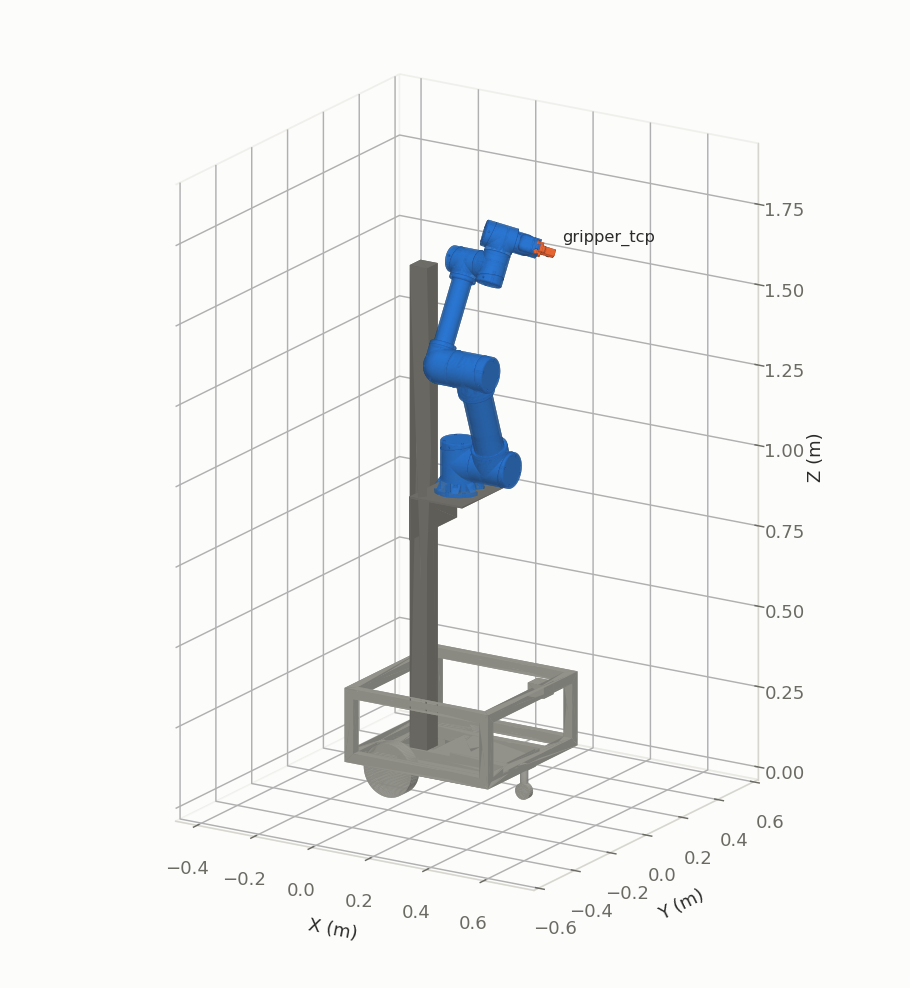
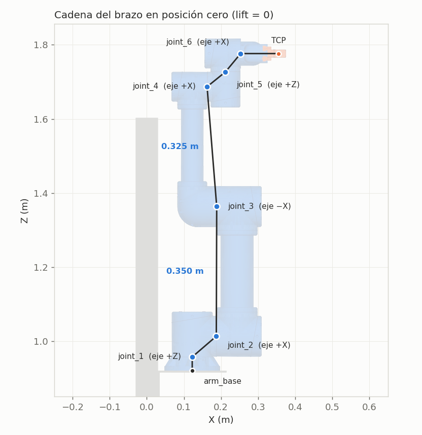
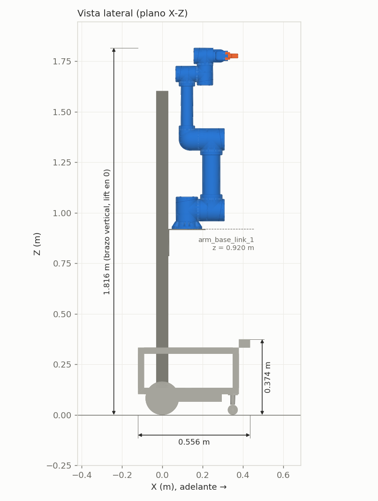

# Brazo de Milo (`andesrobot_arm`)

Cinemática directa e inversa del brazo + lift, control en Gazebo y marcador interactivo en RViz.
Solo el brazo: la base se supone quieta (el diff drive y el SLAM son de los otros paquetes).
El robot real todavía no tiene driver para el brazo: esto funciona **solo en simulación**.

## Usarlo

```bash
cd ~/milo_ws
./sim.sh brazo          # Gazebo + Milo con el brazo controlado + IK + marcador + RViz
```

En RViz: herramienta **Interact** (tecla `i`), arrastra la esfera naranja y suelta. El brazo va a esa
pose. Si no se mueve, la pose está fuera de alcance (el log dice `IK sin solución`): clic derecho en
la esfera → **Volver a la pinza**.

Mandar una pose a mano (en otra terminal, `./sim.sh shell`):

```bash
ros2 topic pub --once /arm_target_pose geometry_msgs/msg/PoseStamped \
  "{header: {frame_id: base_footprint}, pose: {position: {x: 0.5048, y: -0.2163, z: 1.862},
    orientation: {x: -0.1252, y: 0.5501, z: -0.7869, w: 0.2502}}}"
```

Abrir / cerrar la pinza (`right_finger_joint`: −0.007 cerrada … 0.016 abierta):

```bash
ros2 action send_goal /gripper_controller/follow_joint_trajectory control_msgs/action/FollowJointTrajectory \
  "{trajectory: {joint_names: [right_finger_joint], points: [{positions: [0.016], time_from_start: {sec: 1}}]}}"
```

Sin Docker (ROS Humble instalado en el PC): `ros2 launch andesrobot_arm arm_sim.launch.py`
(`gui:=false` sin ventana de Gazebo, `rviz:=false` sin RViz, `camara:=false` sin la cámara de la
pinza, `mesa:=false` sin la mesa de prueba).

Tests (sin ROS corriendo): `source install/setup.bash && cd src/andesrobot_arm && python3 -m pytest -q test`

## Cámara de la pinza (Orbbec Gemini Plus)

`./sim.sh brazo` monta la cámara sobre la pinza (`andesrobot_description/urdf/andesrobot.gripper_camera.xacro`,
malla `meshes/orbbec_gemini_plus.stl`) y pone una mesa con tres objetos frente a Milo
(`worlds/mesa_prueba.sdf`). Canales, con los mismos nombres que el driver real `OrbbecSDK_ROS2`
lanzado con `camera_name:=gripper_camera`:

| Topic | Qué es | Simulación |
|---|---|---|
| `/gripper_camera/color/image_raw` | imagen a color | 640×480 `rgb8`, FOV 71° |
| `/gripper_camera/depth/image_raw` | profundidad | 640×400 `32FC1` en metros, 0.25–2.5 m, FOV 67.9° |
| `/gripper_camera/depth/points` | nube de puntos con color | en `gripper_camera_depth_optical_frame` |
| `/gripper_camera/ir/image_raw` | infrarrojo | 640×400 `mono8` |

Cada uno trae su `camera_info`; todos a 15 Hz (`gripper_camera_rate` en el xacro; la real llega a
30). RViz los muestra en los paneles *Camara color / profundidad / infrarrojo* y la nube en 3D.
Guardar una imagen de cada canal (en otra terminal, `./sim.sh shell`):

```bash
ros2 run andesrobot_arm capturar_camara     # -> ~/milo_ws/ros2_ws/capturas/<fecha>/
```

Deja `color.png`, `ir.png`, `profundidad_mm.png` (16 bits en mm, como la real), `profundidad_vista.png`,
`nube.ply` y `resumen.txt`. Para que la cámara mire la mesa, mandar la pinza arriba de ella
apuntando 45° hacia abajo:

```bash
ros2 topic pub --once /arm_target_pose geometry_msgs/msg/PoseStamped \
  "{header: {frame_id: base_footprint}, pose: {position: {x: 0.5, y: 0.0, z: 1.4},
    orientation: {x: 0.3827, y: 0.0, z: 0.9239, w: 0.0}}}"
```

Montaje: soporte con bisagra sobre la cara superior de `link_6_1`, cámara mirando hacia donde apunta
la pinza e inclinada 20° hacia abajo (`gripper_camera_tilt`). Frames: `gripper_camera_link` (cuerpo),
`gripper_camera_{color,depth,ir}_frame` (cada lente) y sus `_optical_frame` (Z adelante, los de los
mensajes). La profundidad empieza a 0.25 m: la cámara **no ve el objeto en el agarre final** (los
dedos quedan a ~9 cm); se mide desde una pose previa y después se cierra sin ver.

Diferencias con la cámara real: la profundidad real llega en mm (`16UC1`) con ruido y huecos, y el IR
real muestra el patrón de puntos del proyector; en Gazebo la profundidad es perfecta y el IR es una
imagen gris. Gazebo publica además `/gripper_camera/depth/color_sim/*`, que no existe en la real.

## Verlo en el navegador

`docs/escena_web/README.md` (en la raíz del repo) es la guía para armar una escena web de Milo y la
arena (three.js + Vite): piezas, colores, convenciones, escenario y cómo funcionan la cinemática
inversa y la cámara, con valores de referencia. El paquete de datos lo genera `python3 /ros2_ws/src/andesrobot_arm/scripts/exportar_escena_web.py` (dentro de
`./sim.sh shell`) en `~/milo_ws/ros2_ws/escena_web/`.

## Qué corre

| Pieza | Qué hace |
|---|---|
| `arm_sim.launch.py` | xacro con `lock_arm:=false arm_control:=true gripper_camera:=true` → Gazebo, spawn de Milo y la mesa, controladores, nodos, RViz |
| `arm_controller` | `JointTrajectoryController`: `vertical_lift_joint` + `joint_1..6` en una sola trayectoria, con tolerancias de meta (aborta si el brazo no llega) |
| `gripper_controller` | `JointTrajectoryController`: `right_finger_joint` (el izquierdo lo copia Gazebo, `mimic`) |
| `arm_ik_node` | escucha `/arm_target_pose` (cualquier frame de TF), resuelve la IK y manda la trayectoria |
| `arm_marker_node` | marcador en RViz sobre `gripper_tcp`; al soltar publica en `/arm_target_pose` (frame `base_footprint`) |
| `capturar_camara` | guarda una imagen de cada canal de la cámara de la pinza (`ros2 run andesrobot_arm capturar_camara`) |

Parámetros de `arm_ik_node`:

| Parámetro | Default | Uso |
|---|---|---|
| `use_lift` | true | false = IK de 6 articulaciones en `arm_base_link_1`, el lift no se mueve |
| `lift_weight` | 10.0 | peso del lift en la IK: mayor = lo mueve menos |
| `position_only` | false | ignorar la orientación del objetivo |
| `max_joint_velocity` / `max_lift_velocity` | 0.5 rad/s / 0.1 m/s | para calcular la duración |
| `min_duration` | 1.0 s | duración mínima de cada movimiento |

## Geometría (del URDF, marco `base_footprint`)

| | |
|---|---|
|  |  |
|  |  |

Robot completo (brazo vertical, lift en 0): 0.556 m de largo (x = −0.12 … 0.436), 0.500 m de ancho,
1.816 m de alto. Base hasta el lidar: 0.374 m. Ruedas: 0.3605 m entre centros.

- Brazo: hombro → codo 0.350 m, codo → muñeca 0.325 m; joint_4 → joint_5 → joint_6: 0.064 + 0.064 m.
- `gripper_tcp`: 0.102 m hacia −X de `link_6_1`, centro de las caras internas de los dedos
  (x = −0.083 … −0.121, punta en −0.1224). Apertura de la pinza: 0.017 + 2·q (3 … 49 mm).
- `arm_base_link_1` con lift en 0: (0.1225, 0, 0.920). Hombro (joint_2): z = 0.613 … 1.613 m según el lift.
- Con joint_1 = 0, los ejes de joint_2, 3, 4 y 6 son paralelos a X: el brazo se dobla hacia los
  costados. Para trabajar al frente, joint_1 gira.
- La muñeca **no es esférica** (joint_4 y joint_6 paralelos, a ~9 cm): no hay IK cerrada.

Alcance del TCP (muestreo aleatorio de 60 000 configuraciones, sin choques ni límites reales):

| Lift | Alturas del TCP | Alcance horizontal máx. (desde `base_footprint`) |
|---|---|---|
| −0.4 m | suelo … 1.45 m | 0.95 m |
| 0.0 m | 0.17 … 1.84 m | 0.96 m |
| +0.6 m | 0.78 … 2.44 m | 0.95 m |

Al frente (x máx.): 0.52 m a ras del suelo, 0.77 m a 0.30 m de altura, 0.89 m a 0.75 m, 0.93 m a 1.0 m.


Las figuras y `figuras/medidas.json` salen de `scripts/figuras.py`, que lee el URDF y las mallas:
si cambia el xacro, regenerarlas (dentro del contenedor, `./sim.sh shell`):

```bash
source /ros2_ws/install/setup.bash && cd /ros2_ws/src/andesrobot_arm
python3 scripts/figuras.py docs/figuras
```

## Métodos y ecuaciones

**Cinemática directa** (`kinematics.py`): producto de transformaciones leídas del URDF,
`T(q) = Π T_origin,i · M_i(q_i)`, con `R_origin = Rz(yaw)·Ry(pitch)·Rx(roll)`,
`M_rot = Rodrigues(eje, q)` y `M_pris = traslación q·eje`.

**Jacobiano geométrico**: rotativa `J_i = [z_i × (p_tcp − p_i); z_i]`, prismática `J_i = [z_i; 0]`.

**Cinemática inversa** (DLS ponderado, `ArmKinematics.ik`):

- Error: `e = [p_d − p ; log(R_d·Rᵀ)]` (el segundo es el vector de rotación eje·ángulo).
- Paso: `Δq = W⁻¹Jᵀ(J W⁻¹Jᵀ + λ²I)⁻¹ e`, recortado a ‖Δq‖ ≤ 0.5; λ = 0.01.
  `W` = peso por articulación (el lift lleva 10: con 7 articulaciones hay infinitas soluciones
  y así prefiere mover el brazo).
- Límites: se recorta a los del URDF; si el rango es una vuelta completa (los ±π provisorios),
  el ángulo da la vuelta en vez de recortarse.
- Converge con ‖e_p‖ < 0.1 mm y ‖e_R‖ < 1 mrad. Primer intento desde la posición actual; si
  falla, hasta 20 reinicios al azar dentro de los límites.

**Duración de la trayectoria**: `T = max(min_duration, max_i |Δq_i| / v_i)`.

## Limitaciones

- **Límites provisorios** (±π, 20 N·m, 1 rad/s): la IK puede devolver posturas que el brazo real no hace.
  Cambiar `arm_lower`/`arm_upper`/`arm_effort`/`arm_velocity` en `andesrobot.urdf.xacro`.
- **Giros largos cerca de ±π**: una articulación no puede pasar de ±π, así que si el objetivo queda
  "al otro lado" da casi una vuelta completa. Ejemplo medido: `joint_1` de 3.05 a −3.03 rad recorre
  6.08 rad en 12.2 s en vez de 0.2 rad. Se arregla con los topes reales.
- **Sin revisión de choques**: la IK no sabe dónde están el chasis, la columna ni la mesa, y el brazo
  va directo a la solución. Desde que `arm_controller` tiene **tolerancias de meta**
  (`config/arm_controllers.yaml`: 0.02 rad por articulación, 5 mm el lift, 1 s de margen), si queda
  bloqueado el controlador aborta y `arm_ik_node` avisa *"el brazo no llegó… ¿chocó con algo?"*, en
  vez de reportar éxito. La pinza no tiene tolerancia a propósito: al agarrar, los dedos quedan frenados.
- **Muñeca distinta al EB300**: el DH oficial del fabricante tiene d₄ = 122, d₅ = 99 y d₆ = 57 mm; el
  URDF (del CAD del equipo), 89.6, 89.5 y 41 mm. El brazo y el antebrazo sí coinciden. Hay que medir
  el brazo real antes de confiar en la posición de la pinza al centímetro.
- **Masas aproximadas**: los motores están (links `motor_joint_N`), pero los reductores EBA valen 0 y
  las piezas impresas se calcularon como ABS macizo.
- **Cámara ideal**: Gazebo da una profundidad perfecta (sin ruido, sombras ni huecos) y un IR sin el
  patrón del proyector. Ver «Cómo hacer realista la profundidad» en el informe (sección 14).
- **Mando por posición**: Gazebo pone las articulaciones en el ángulo pedido sin fuerzas; para
  agarrar objetos de verdad habría que pasar a esfuerzo con PID.
- `simple_collision:=true` deja al brazo sin colisión propia (y una caja fija donde estaría el brazo
  bloqueado): por eso `arm_sim.launch.py` usa las mallas por defecto.
- `gazebo_ros2_control` (Humble) no puede leer un URDF con comentarios XML: `arm_sim.launch.py` los
  borra antes de publicar `/robot_description`. No reemplazar por `rsp.launch.py` sin eso.
